# TaskHub 前端迭代记录

> 用途：记录前端设计、原型和页面效果的历史变化。  
> 要求：以后每次涉及前端页面、交互、视觉、信息结构或权限状态变化，都需要追加一条迭代记录，并补充“模型问答、改动说明、前后截图、验证结果”。已落档的历史迭代不回改，后续迭代只记录本次相对上一版的变化。

## 记录规范

每次前端迭代必须包含：

1. 迭代时间和触发问题。
2. 用户原始提问，必须逐字记录，不改写、不省略、不纠错。
3. 与模型的关键问答。
4. 上一版状态说明。
5. 本次迭代后涉及页面和交互变化。
6. 截图对比。
7. 影响范围：页面、文件、数据、交互、权限、状态。
8. 验证命令和结果。
9. 未覆盖或待后端支持的能力。

截图要求：

- 每个被修改页面都要有改动后截图。
- 如果有上一版页面，必须保留上一版截图并与本次截图并排展示。
- 如果是首次新增页面，没有旧 UI，则使用“改动前基线图”说明之前无对应页面。
- 截图统一放在 `docs/iterations/frontend-prototype/screenshots/`。

## 2026-07-14：首次生成前端页面设计方案与静态原型

### 1. 迭代背景

本轮前，项目主要是 FastAPI 后端服务，已有后端 API、任务编排、Agent 注册、工具执行、数据库持久化和产品 PRD，但没有可打开的前端页面。

本轮需求摘要：

- 结合当前后端项目功能；
- 结合产品文档 `/Users/getui/Documents/Codex/2026-07-13/wo-x/outputs/多任务agent产品文档1.0-优化版.md`；
- 输出一份前端页面设计方案；
- 附带原型图和页面。

### 2. 用户原始提问（逐字）

```text
根据当前后端项目的功能，结合产品文档：/Users/getui/Documents/Codex/2026-07-13/wo-x/outputs/多任务agent产品文档1.0-优化版.md，给出一份前端页面设计方案，附带有原型图和页面
```

```text
把当前前端项目的迭代生成一个前端迭代文档，主要包括与模型的问答，还有改动后涉及的页面效果的变化，要有截图对比，可以明确看出前后的变化和差异，每一次涉及的修改都要这么做下，作为历史迭代纪录
```

### 3. 与模型的关键问答

| 轮次 | 用户问题 | 模型处理 |
|---|---|---|
| 1 | 见“用户原始提问（逐字）”第 1 条 | 读取产品文档、README、后端路由、模型、存储、工作流和数据库持久化测试；识别当前可接 API 与 PRD 完整目标之间的差距。 |
| 2 | 模型执行过程说明 | 明确采用企业内部流程协同平台风格，按“当前后端可接入 MVP 页面”和“产品 1.0 预留页面”分层，不虚构未实现接口。 |
| 3 | 模型产出 | 新增 `前端页面设计方案.md`，新增静态原型三文件：`index.html`、`data.js`、`annotations.js`。 |
| 4 | 见“用户原始提问（逐字）”第 2 条 | 本次新增此迭代记录，并生成改动前基线截图与改动后页面截图。 |

### 4. 修改前状态

修改前没有前端页面，只有后端 API 和文档。用户无法通过浏览器查看：

- 协同总览；
- 任务发布页；
- 人工确认工作台；
- 任务列表；
- 任务详情；
- Agent 管理；
- 审计记录；
- 平台治理入口。

修改前基线截图如下。此图不是旧 UI，而是用于表达“本轮前无前端页面”的对比基线。

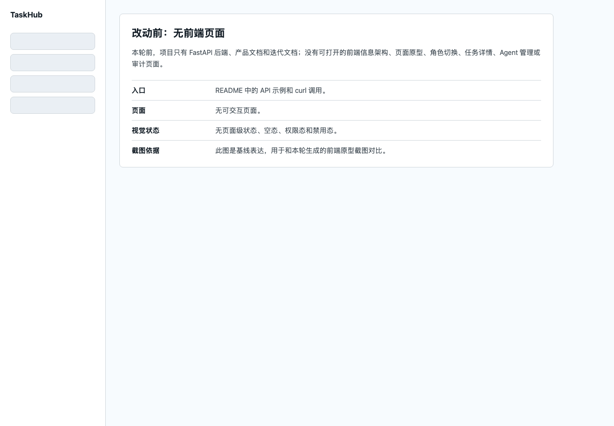

### 5. 修改内容

#### 5.1 新增前端页面设计方案

新增文件：

- `docs/iterations/前端页面设计方案.md`

主要内容：

- 后端 API 对齐表；
- 当前可展示的数据对象；
- 信息架构；
- MVP 页面范围；
- 产品 1.0 预留页面；
- 页面设计说明；
- 角色和权限表达；
- 视觉与组件规范；
- 响应式策略；
- 后续前端开发建议。

#### 5.2 新增静态前端原型

新增目录：

- `docs/iterations/frontend-prototype/`

新增文件：

- `index.html`：页面结构、共享组件样式和交互逻辑；
- `data.js`：演示数据；
- `annotations.js`：标注锚点骨架。

原型页面：

| 页面 | 页面家族 | 本轮效果 |
|---|---|---|
| 协同总览 | overview | 展示任务指标、风险任务、主流程、最近任务和最近事件 |
| 任务发布 | manage | 提供 Request 发布表单和提交结果区域 |
| 人工确认 | manage | 三栏布局：待确认队列、原始请求与草稿、识别依据 |
| 任务列表 | manage | 支持关键词、状态、节点筛选 |
| 任务详情 | detail | 展示目标、上下文、轮次、子任务、事件和人工结果提交入口 |
| Agent 管理 | config | 展示 Agent 能力、工具、状态，并提供注册入口 |
| 审计记录 | record | 从 Task.events 聚合展示事件 |
| 平台治理 | config | 展示 kill switch、规则、来源权限等预留能力 |

#### 5.3 新增页面直达参数

为了支持稳定截图，给原型增加查询参数入口：

```text
index.html?page=overview
index.html?page=confirmation
index.html?page=task-detail
index.html?page=agents
```

默认打开仍是协同总览页。

#### 5.4 新增角色权限演示

角色切换器增加了可见的权限反馈：

- 确认人或管理员可执行“确认并执行”；
- 执行者或管理员可执行“提交结果”；
- 仅管理员可注册 Agent；
- 审计或管理员可使用审计导出预留入口；
- 仅管理员可看到治理类高风险操作可用。

当前权限只是前端原型演示，真实权限仍需要后端权限接口支撑。

### 6. 页面效果截图对比

#### 6.1 总体变化

| 改动前 | 改动后：协同总览 |
|---|---|
|  | 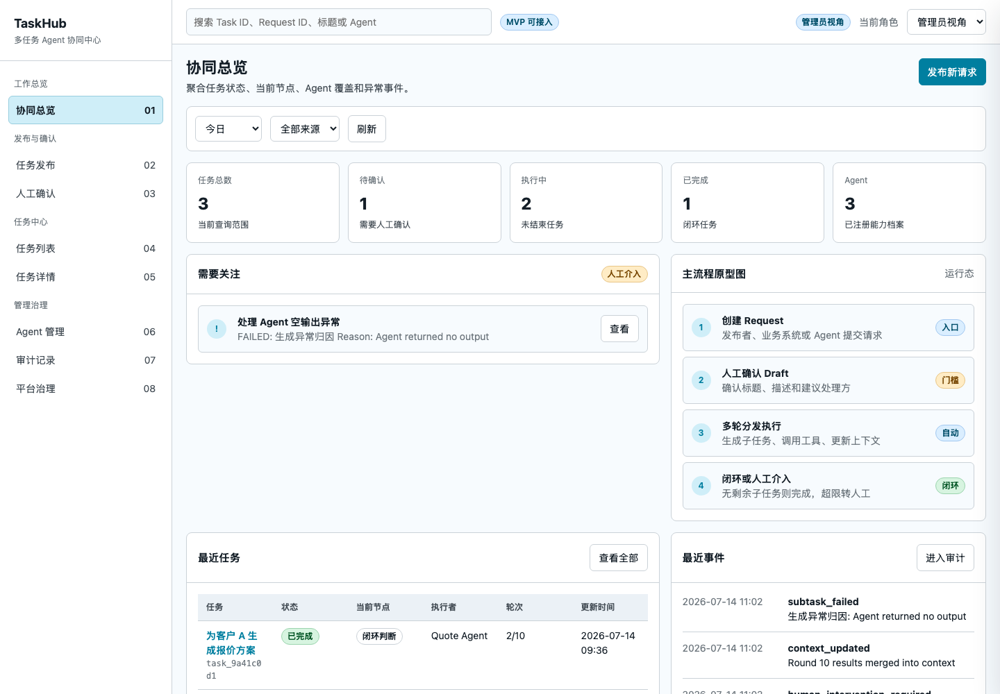 |

变化说明：

- 从“无前端页面”变为有稳定 Shell 的后台工作台；
- 新增左侧导航、顶部搜索、角色切换；
- 新增任务指标、风险任务、主流程原型图、最近任务和最近事件；
- 页面风格从 API 文档/后端项目状态，变成可评审的企业内部工具型 UI。

#### 6.2 人工确认工作台

| 改动前 | 改动后：人工确认 |
|---|---|
|  | 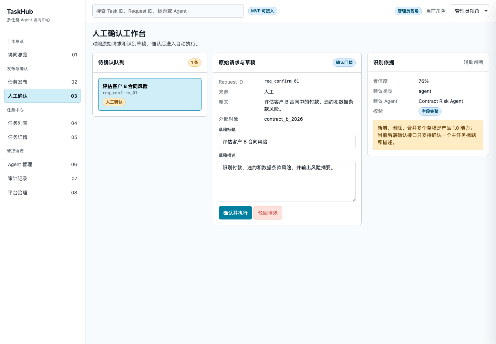 |

变化说明：

- 新增待确认队列；
- 新增原始 Request 与 Task Draft 对照；
- 新增草稿标题和描述编辑区；
- 新增识别依据区，展示置信度、建议 Agent 和校验结果；
- 对当前后端不支持的“新增、删除、合并多个草稿”做预留说明。

#### 6.3 任务详情页

| 改动前 | 改动后：任务详情 |
|---|---|
|  | 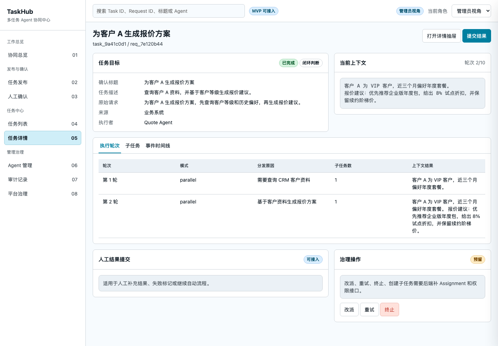 |

变化说明：

- 新增任务顶部摘要；
- 新增任务目标区，展示标题、描述、原始请求、来源和执行者；
- 新增当前上下文区，展示 `context.summary`；
- 新增 Tab：执行轮次、子任务、事件时间线；
- 新增人工结果提交入口；
- 新增治理操作预留区，明确改派、重试、终止需要后端补 Assignment 和权限接口。

#### 6.4 Agent 管理页

| 改动前 | 改动后：Agent 管理 |
|---|---|
|  | 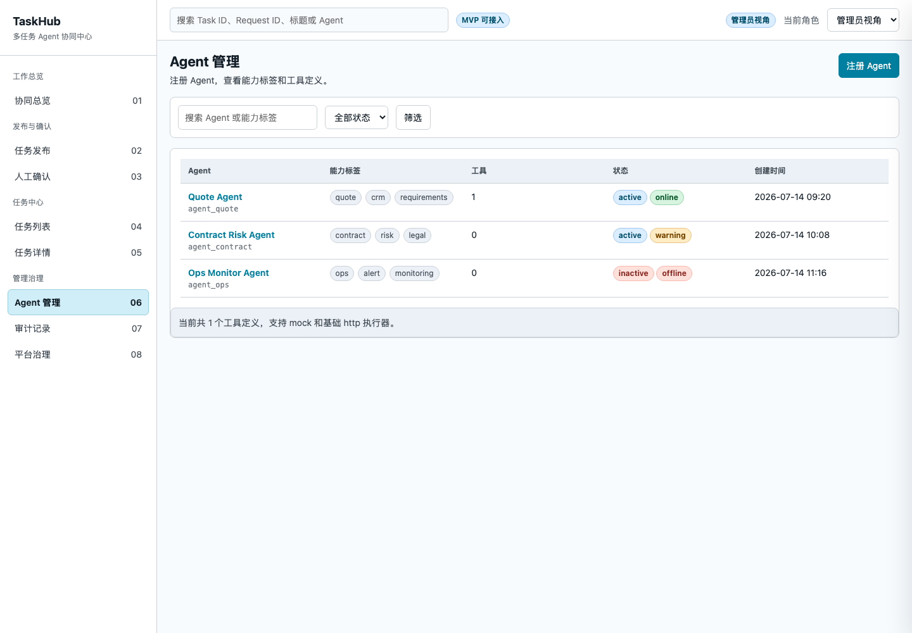 |

变化说明：

- 新增 Agent 表格；
- 展示 Agent ID、能力标签、工具数、状态、创建时间；
- 新增注册 Agent 入口；
- 展示 mock/http 工具能力摘要；
- 为后续 Agent 编辑、启停、心跳、版本管理预留结构。

### 7. 文件变更清单

| 类型 | 文件 |
|---|---|
| 新增文档 | `docs/iterations/前端页面设计方案.md` |
| 新增原型 | `docs/iterations/frontend-prototype/index.html` |
| 新增演示数据 | `docs/iterations/frontend-prototype/data.js` |
| 新增标注锚点 | `docs/iterations/frontend-prototype/annotations.js` |
| 新增截图基线页 | `docs/iterations/frontend-prototype/screenshots/before-no-frontend.html` |
| 新增截图 | `docs/iterations/frontend-prototype/screenshots/2026-07-14-before-no-frontend.png` |
| 新增截图 | `docs/iterations/frontend-prototype/screenshots/2026-07-14-after-overview.png` |
| 新增截图 | `docs/iterations/frontend-prototype/screenshots/2026-07-14-after-confirmation.png` |
| 新增截图 | `docs/iterations/frontend-prototype/screenshots/2026-07-14-after-task-detail.png` |
| 新增截图 | `docs/iterations/frontend-prototype/screenshots/2026-07-14-after-agents.png` |
| 新增迭代记录 | `docs/iterations/前端迭代记录.md` |

### 8. 验证记录

| 验证项 | 命令/方式 | 结果 |
|---|---|---|
| 外部数据脚本语法 | `node --check docs/iterations/frontend-prototype/data.js` | 通过 |
| 标注脚本语法 | `node --check docs/iterations/frontend-prototype/annotations.js` | 通过 |
| 页面内联脚本语法 | 提取 `index.html` 内联脚本后执行 `node --check /private/tmp/taskhub-prototype-inline.js` | 通过 |
| 标注锚点覆盖 | 对比 HTML 中 `data-annotation-id` 与 `annotations.js` 的 `anchorIds` | HTML 静态锚点 73 个，全部已登记；额外 7 个为运行时抽屉/弹窗锚点 |
| 截图生成 | Chrome Headless | 已生成 5 张截图 |
| 截图人工检查 | 使用本地图片查看工具检查 | 图片非空，能看出改动前后差异 |

### 9. 当前未覆盖项

以下能力来自产品文档，但当前后端公开 API 尚未完整支撑，因此前端原型只做预留态：

- Request 独立详情页；
- Assignment 领取、租约、续租、释放；
- 人工执行者“我的任务”真实待办；
- Agent 心跳和启停版本；
- 规则与模板编辑；
- 来源权限管理；
- kill switch 真实开关；
- 审计记录分页查询和导出；
- 子任务创建接口；
- 改派、重试、人工终止。

## 2026-07-14：协同总览页驾驶舱化优化

### 1. 触发问题

- 用户原始提问：见“用户原始提问（逐字）”第 1 条。
- 模型理解：本次不是重新生成前端原型，而是在上一版静态原型基础上做一次页面优化。`ys-dashboard` 适用于大屏、驾驶舱、指挥中心类页面，因此只优化“协同总览”页，不把任务发布、人工确认、任务列表等普通后台页改成大屏。
- 本轮目标：记录本次相对上一版“协同总览”的变化，保留已落档的首次迭代记录。

### 2. 用户原始提问（逐字）

```text
用ys-dashboard skill工具优化下页面，把页面的迭代记录到前端页面迭代文档中
```

```text
你没理解我的意思，前端迭代文档相当于一个历史纪录，已经记录的迭代就不要再改了，后续的迭代纪录的是当次迭代后跟之前的变化。重新改下
```

```text
把我的提问也要原样纪录到迭代文档中，不要改一个字
```

### 3. 与模型的关键问答

| 轮次 | 用户问题 | 模型处理 |
|---|---|---|
| 1 | 见“用户原始提问（逐字）”第 1 条 | 读取本地 `ys-dashboard` 规则，确认适用范围是驾驶舱/大屏类页面。 |
| 2 | 页面应该怎么优化 | 选择上一版已有的 `overview` 协同总览页作为优化对象，其他页面保持首次原型结构。 |
| 3 | 见“用户原始提问（逐字）”第 1 条 | 追加本次迭代记录，截图对比改为“上一版页面效果”对比“本次迭代后页面效果”。 |
| 4 | 见“用户原始提问（逐字）”第 2 条 | 调整记录方式：已落档的首次迭代不回改，本次记录追加到其后，明确只描述本次相对上一版的变化。 |
| 5 | 见“用户原始提问（逐字）”第 3 条 | 补充逐字提问记录，并避免在问答表中改写用户原话。 |

### 4. 上一版状态

上一版来自“2026-07-14：首次生成前端页面设计方案与静态原型”。

涉及页面：

- `docs/iterations/frontend-prototype/index.html?page=overview`

上一版状态：

- 页面名称为“协同总览”。
- 首屏结构是筛选条、5 个指标卡、风险面板、主流程原型图、最近任务、最近事件。
- 页面更像普通后台工作台，能看任务状态和流程，但驾驶舱感不强。
- Agent 覆盖、节点负载、工具成功率、循环触顶等运行态信息没有在总览首屏集中表达。

上一版截图：


### 5. 本次修改内容

| 页面/模块 | 相对上一版的变化 | 文件 |
|---|---|---|
| 协同总览页头 | 标题从“协同总览”改为“协同运营驾驶舱”，新增“驾驶舱全屏”按钮 | `docs/iterations/frontend-prototype/index.html` |
| 核心指标区 | 由 5 个指标扩展为 6 个指标，新增完成率和介入数表达 | `docs/iterations/frontend-prototype/index.html` |
| 运行信号区 | 新增数据模式、运行模式、工具成功率、审计事件 4 个运行信号卡 | `docs/iterations/frontend-prototype/index.html` |
| 中央流程区 | 保留原主流程，新增节点态势矩阵，展示请求接入、人工确认、分发执行、上下文沉淀、闭环判断、人工介入 | `docs/iterations/frontend-prototype/index.html` |
| 右侧信息区 | 新增 Agent 覆盖面板，集中展示 Agent 健康状态、能力标签、关联任务和工具数 | `docs/iterations/frontend-prototype/index.html` |
| 下方辅助区 | 新增自动化收敛面板，展示平均循环、最大轮次触顶、工具调用和工具成功率 | `docs/iterations/frontend-prototype/index.html` |
| 标注锚点 | 追加驾驶舱健康、命令布局、节点矩阵、Agent 覆盖、自动化收敛锚点 | `docs/iterations/frontend-prototype/annotations.js` |

### 6. 页面效果截图对比

| 上一版 | 本次迭代后 |
|---|---|
|  |  |

差异说明：

- 上一版是常规后台总览，本次变成更偏运行监控的驾驶舱布局。
- 上一版主流程和风险面板并列展示，本次改为“左风险、中节点态势、右 Agent 覆盖”的三栏结构。
- 上一版最近任务和最近事件是主要下方内容，本次保留最近任务，同时新增自动化收敛面板。
- 本次新增全屏能力，适合评审或大屏展示，但数据仍是 mock 演示数据。

### 7. 影响范围

| 类型 | 影响 |
|---|---|
| 页面 | 只影响 `overview` 协同总览页 |
| 交互 | 新增驾驶舱全屏按钮；刷新、发布新请求、查看任务、进入审计、Agent 抽屉保留 |
| 数据 | 不新增真实接口；新增指标均从现有 `demo.tasks`、`demo.agents`、`demo.flattenEvents()` 派生 |
| 权限 | 未改变角色权限逻辑 |
| 标注 | 新增 5 个总览页锚点 |
| 截图 | 本次新增 `2026-07-14-before-ys-dashboard-overview.png` 和 `2026-07-14-after-ys-dashboard-overview.png` |

### 8. 验证记录

| 验证项 | 命令/方式 | 结果 |
|---|---|---|
| 外部数据脚本语法 | `node --check docs/iterations/frontend-prototype/data.js` | 通过 |
| 标注脚本语法 | `node --check docs/iterations/frontend-prototype/annotations.js` | 通过 |
| 页面内联脚本语法 | 使用 Node 读取 `index.html` 最后一个内联脚本并执行 `new Function(...)` 解析 | 通过，输出 `inline script parse ok` |
| 标注锚点覆盖 | 对比 HTML 中 `data-annotation-id` 与 `annotations.js` 的 `anchorIds` | HTML 静态锚点 78 个，全部已登记；额外 7 个为运行时抽屉/弹窗锚点 |
| 截图生成 | Chrome Headless | 已生成本次优化前、优化后截图 |
| 截图检查 | 本地图片查看工具 | 首屏和长屏截图非空，无明显遮挡；能看出相对上一版的布局变化 |

### 9. 当前未覆盖项

- 本次没有新增真实后端接口。
- 驾驶舱数据仍为 mock 演示数据，不能作为生产运行态数据。
- 没有引入地图、飞线、热力图等地理大屏能力，因为当前业务和后端数据不包含地理字段。
- 其他普通管理页保持上一版结构，未做大屏化处理。

## 2026-07-14：页面背景颜色优化

### 1. 触发问题

- 用户原始提问：见“用户原始提问（逐字）”第 1 条。
- 模型理解：本次是在上一版协同运营驾驶舱基础上，只优化页面背景和容器层次，不改变业务流程、页面结构、数据或权限。
- 本轮目标：让背景颜色更柔和、更有层次，同时保持后台工作台的清晰度和可读性。

### 2. 用户原始提问（逐字）

```text
页面需要优化下，背景的颜色要好看一些
```

### 3. 与模型的关键问答

| 轮次 | 用户问题 | 模型处理 |
|---|---|---|
| 1 | 见“用户原始提问（逐字）”第 1 条 | 将改动范围收敛到全局背景、导航、工具栏、面板和指标卡的视觉层次；不改业务交互和数据。 |

### 4. 上一版状态

上一版来自“2026-07-14：协同总览页驾驶舱化优化”。

涉及页面：

- `docs/iterations/frontend-prototype/index.html?page=overview`

上一版状态：

- 页面背景以偏灰白和浅蓝为主。
- 导航、顶部栏、面板、指标卡大多是接近纯白的平面容器。
- 页面结构清晰，但背景层次偏弱，整体观感比较冷淡。

上一版截图：

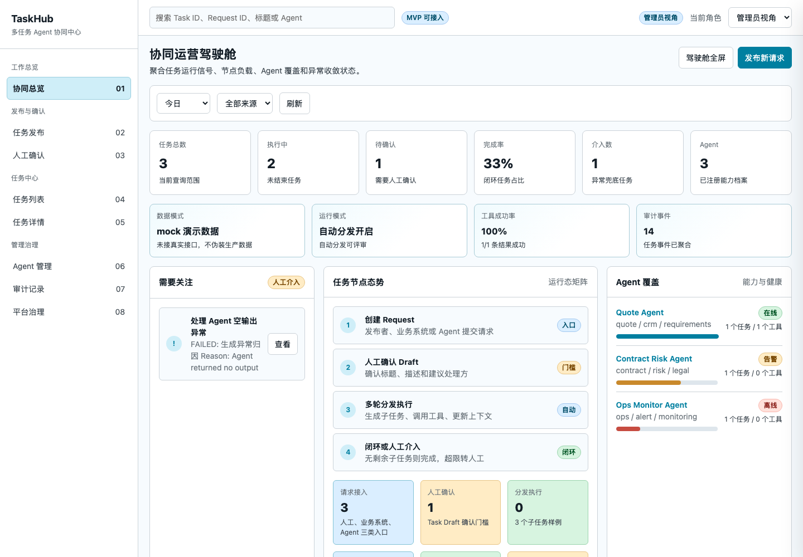

### 5. 本次修改内容

| 页面/模块 | 相对上一版的变化 | 文件 |
|---|---|---|
| 页面底色 | 从单一浅灰白改为低饱和蓝绿灰线性渐变 | `docs/iterations/frontend-prototype/index.html` |
| 内容区背景 | 增加轻微纵向渐变，强化页面主内容和侧栏的区分 | `docs/iterations/frontend-prototype/index.html` |
| 左侧导航和顶部工具栏 | 改为半透明浅色背景，增加轻微模糊和边界层次 | `docs/iterations/frontend-prototype/index.html` |
| 面板和指标卡 | 增加浅色渐变和轻阴影，使卡片从背景中浮起来 | `docs/iterations/frontend-prototype/index.html` |
| 颜色 token | 调整 `surface`、`border`、`accent-soft` 等基础色，使整体更柔和 | `docs/iterations/frontend-prototype/index.html` |

### 6. 页面效果截图对比

| 上一版 | 本次迭代后 |
|---|---|
|  | 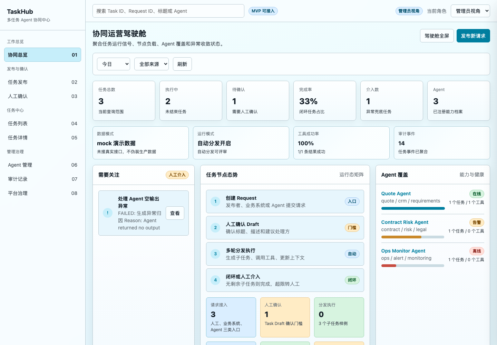 |

差异说明：

- 上一版背景更接近灰白，本次改为更柔和的浅蓝绿灰渐变。
- 面板和指标卡增加轻微层次，页面不再显得过平。
- 文字、按钮、状态标签和表格可读性保持不变。

### 7. 影响范围

| 类型 | 影响 |
|---|---|
| 页面 | 影响静态原型的整体背景和公共容器样式，截图以 `overview` 页为代表 |
| 交互 | 无变化 |
| 数据 | 无变化 |
| 权限 | 无变化 |
| 标注 | 无新增锚点 |
| 截图 | 本次新增 `2026-07-14-before-background-polish-overview.png` 和 `2026-07-14-after-background-polish-overview.png` |

### 8. 验证记录

| 验证项 | 命令/方式 | 结果 |
|---|---|---|
| 外部数据脚本语法 | `node --check docs/iterations/frontend-prototype/data.js` | 通过 |
| 标注脚本语法 | `node --check docs/iterations/frontend-prototype/annotations.js` | 通过 |
| 页面内联脚本语法 | 使用 Node 读取 `index.html` 最后一个内联脚本并执行 `new Function(...)` 解析 | 通过，输出 `inline script parse ok` |
| 截图生成 | Chrome Headless | 已生成本次优化前、优化后截图 |
| 截图检查 | 本地图片查看工具 | 图片非空，背景变化明显，首屏文字和卡片内容可读 |

### 9. 当前未覆盖项

- 本次只做视觉底色优化，没有重新设计组件布局。
- 没有新增主题切换能力。
- 没有生成其他页面截图；公共背景样式会影响全局，当前以协同总览页作为代表截图。

## 2026-07-14：任务详情并入任务列表页

### 1. 触发问题

- 用户原始提问：见“用户原始提问（逐字）”第 1 条。
- 模型理解：任务详情不应再作为左侧独立菜单页，而应成为任务列表页中的右侧详情区；任务表需要新增“详情”列，点击后在同一页查看任务详情。
- 本轮目标：减少导航层级，让任务列表和任务详情形成同屏联动。

### 2. 用户原始提问（逐字）

```text
优化页面布局，任务详情不要单独一个菜单，直接在任务列表后面加一列详情，点击详情里面就是任务详情页面
```

### 3. 与模型的关键问答

| 轮次 | 用户问题 | 模型处理 |
|---|---|---|
| 1 | 见“用户原始提问（逐字）”第 1 条 | 移除左侧“任务详情”菜单，将原独立任务详情页嵌入任务列表页右侧，并在任务表最后增加“详情”列。 |

### 4. 上一版状态

上一版来自“2026-07-14：页面背景颜色优化”。

涉及页面：

- `docs/iterations/frontend-prototype/index.html?page=tasks`

上一版状态：

- 左侧导航中有独立的“任务详情”菜单。
- 任务列表页只展示任务表，点击任务会跳转到单独的任务详情页面。
- 列表和详情需要跨菜单切换，不能同屏查看。

上一版截图：

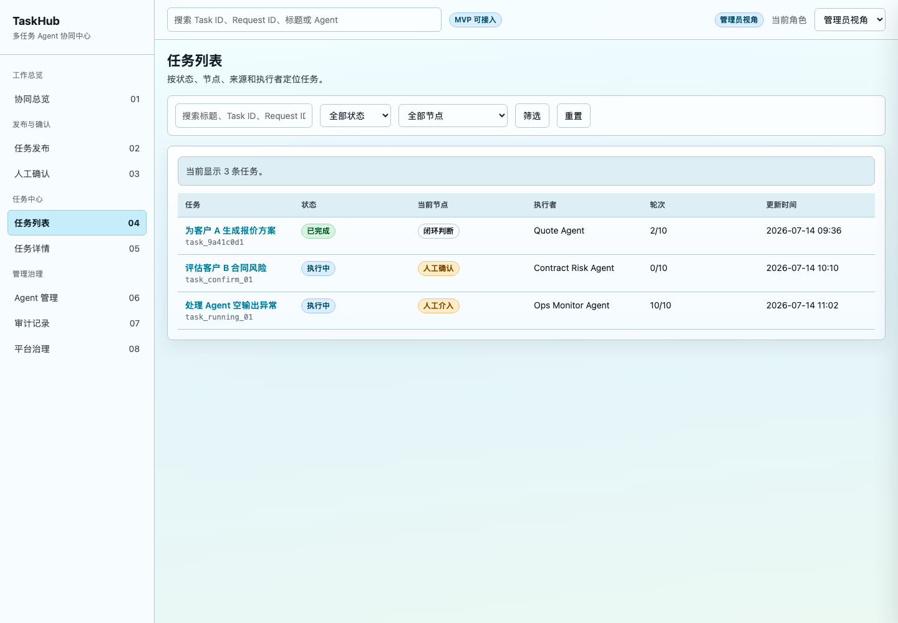

### 5. 本次修改内容

| 页面/模块 | 相对上一版的变化 | 文件 |
|---|---|---|
| 左侧导航 | 移除“任务详情”菜单，后续菜单编号顺延 | `docs/iterations/frontend-prototype/index.html` |
| 任务列表页 | 改为左右双栏：左侧任务表，右侧任务详情 | `docs/iterations/frontend-prototype/index.html` |
| 任务表 | 最后一列新增“详情”按钮，点击后在右侧刷新详情 | `docs/iterations/frontend-prototype/index.html` |
| 任务详情 | 从独立页面改为任务列表页右侧详情面板，保留任务目标、当前上下文、执行轮次、子任务、事件时间线、提交结果和治理操作 | `docs/iterations/frontend-prototype/index.html` |
| 任务点击逻辑 | `data-open-task` 不再跳 `task-detail` 页面，统一进入/停留在 `tasks` 页并选中任务 | `docs/iterations/frontend-prototype/index.html` |
| 标注锚点 | 新增 `tasks-workspace`，保留任务详情相关锚点用于右侧详情区 | `docs/iterations/frontend-prototype/annotations.js` |

### 6. 页面效果截图对比

| 上一版 | 本次迭代后 |
|---|---|
|  | 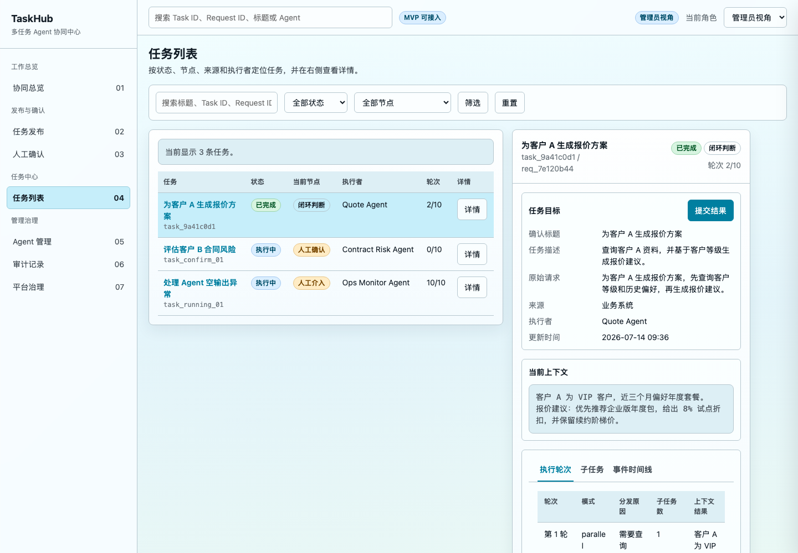 |

差异说明：

- 上一版左侧有“任务详情”独立菜单，本次已移除。
- 上一版任务列表只有表格，本次右侧直接展示任务详情。
- 本次任务表最后新增“详情”列，点击后在右侧切换详情内容。
- 为避免双栏表格过挤，左侧任务表不再展示更新时间，更新时间放入右侧任务目标信息中。

### 7. 影响范围

| 类型 | 影响 |
|---|---|
| 页面 | 影响任务列表页和左侧导航 |
| 交互 | 点击任务标题或“详情”按钮会选中任务并在右侧展示详情，不再跳转独立详情页 |
| 数据 | 无变化 |
| 权限 | 无变化；提交结果按钮仍受原角色权限控制 |
| 标注 | 新增 `tasks-workspace` 锚点 |
| 截图 | 本次新增 `2026-07-14-before-task-detail-inline-tasks.png` 和 `2026-07-14-after-task-detail-inline-tasks.png` |

### 8. 验证记录

| 验证项 | 命令/方式 | 结果 |
|---|---|---|
| 外部数据脚本语法 | `node --check docs/iterations/frontend-prototype/data.js` | 通过 |
| 标注脚本语法 | `node --check docs/iterations/frontend-prototype/annotations.js` | 通过 |
| 页面内联脚本语法 | 使用 Node 读取 `index.html` 最后一个内联脚本并执行 `new Function(...)` 解析 | 通过，输出 `inline script parse ok` |
| 标注锚点覆盖 | 对比 HTML 中 `data-annotation-id` 与 `annotations.js` 的 `anchorIds` | HTML 静态锚点全部已登记 |
| 截图生成 | Chrome Headless | 已生成本次优化前、优化后截图 |
| 截图检查 | 本地图片查看工具 | 左侧菜单已无“任务详情”，任务表有“详情”列，右侧详情面板可见 |

### 9. 当前未覆盖项

- 本次没有接入真实任务详情 API，仍使用静态 demo 数据。
- 右侧详情区为单任务详情展示，没有做多任务对比。
- 未新增深链参数来直接打开某个 Task ID。

## 2026-07-14：任务详情改为独立页面打开

### 1. 触发问题

- 用户原始提问：见“用户原始提问（逐字）”第 1 条和第 2 条。
- 模型理解：上一版把任务列表和任务详情放在同一个页面，视觉上太挤；本次要恢复“列表页 + 详情页”的页面分离，但任务详情不作为左侧常驻菜单，而是从任务列表的“详情”按钮进入。
- 本轮目标：让任务列表保持宽松表格布局，点击详情后进入对应任务的独立详情页面。

### 2. 用户原始提问（逐字）

```text
页面优化，任务列表和任务详情页面不要挤到一个页面，详情要在一个新的页面打开对应的任务详情页面，先不要改，告诉我你准备怎么做？
```

```text
改吧
```

### 3. 与模型的关键问答

| 轮次 | 用户问题 | 模型处理 |
|---|---|---|
| 1 | 见“用户原始提问（逐字）”第 1 条 | 先说明计划：任务列表恢复独立页，任务表保留“详情”列，点击进入对应任务详情页；任务详情不放回左侧菜单。 |
| 2 | 见“用户原始提问（逐字）”第 2 条 | 按确认方案实现页面拆分，并补充本次前后截图和迭代记录。 |

### 4. 上一版状态

上一版来自“2026-07-14：任务详情并入任务列表页”。

涉及页面：

- `docs/iterations/frontend-prototype/index.html?page=tasks`
- `docs/iterations/frontend-prototype/index.html?page=task-detail`

上一版状态：

- 任务列表和任务详情挤在一个左右双栏页面。
- 任务表最后有“详情”列，但点击后只是在右侧详情区切换任务。
- 左侧菜单已经没有“任务详情”，但详情内容仍占用任务列表页空间。

上一版截图：


### 5. 本次修改内容

| 页面/模块 | 相对上一版的变化 | 文件 |
|---|---|---|
| 任务列表页 | 从左右双栏恢复为单列表格页面，详情不再占用右侧空间 | `docs/iterations/frontend-prototype/index.html` |
| 任务表 | 保留最后一列“详情”，点击后进入对应任务详情页面 | `docs/iterations/frontend-prototype/index.html` |
| 任务详情页 | 恢复为独立 `page-task-detail` 页面，展示任务目标、当前上下文、执行轮次、子任务、事件时间线、提交结果和治理操作 | `docs/iterations/frontend-prototype/index.html` |
| 左侧导航 | 不新增“任务详情”菜单；进入详情页时左侧仍高亮“任务列表”，表达详情归属 | `docs/iterations/frontend-prototype/index.html` |
| 标注锚点 | 移除不再使用的 `tasks-workspace` 锚点，保留任务详情页相关锚点 | `docs/iterations/frontend-prototype/annotations.js` |

### 6. 页面效果截图对比

| 上一版 | 本次迭代后：任务列表 |
|---|---|
|  | 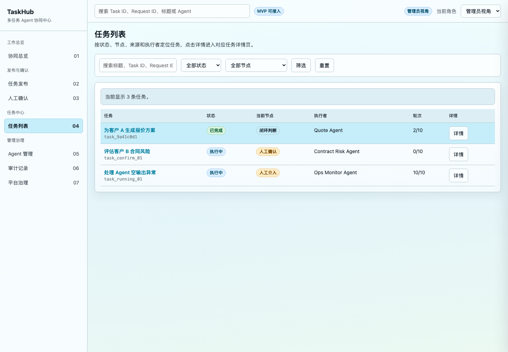 |

| 本次迭代后：任务详情页 |
|---|
| 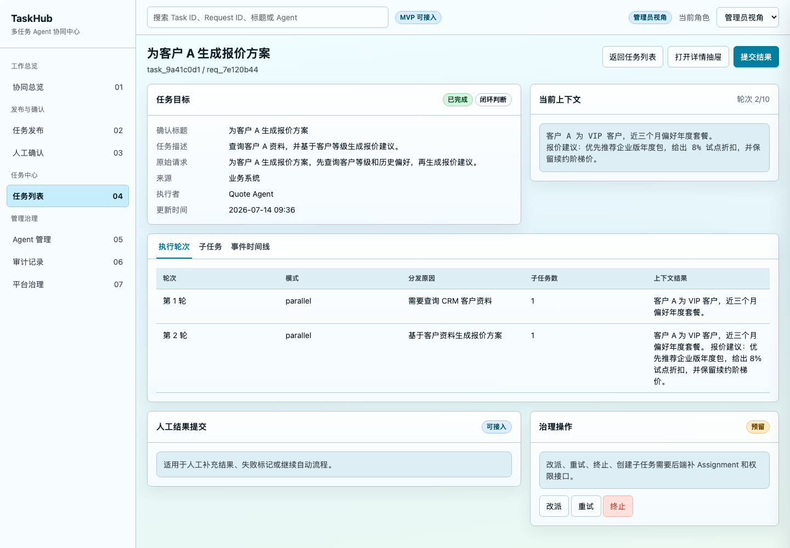 |

差异说明：

- 上一版任务表和详情挤在一个页面，本次拆成列表页和详情页。
- 任务列表页只保留任务筛选和任务表，空间更宽松。
- 点击“详情”后进入独立任务详情页，页面顶部提供“返回任务列表”按钮。
- 左侧不恢复“任务详情”菜单，避免详情页成为孤立导航入口。

### 7. 影响范围

| 类型 | 影响 |
|---|---|
| 页面 | 影响任务列表页和任务详情页 |
| 交互 | 点击任务标题或“详情”按钮进入独立任务详情页；详情页可返回任务列表 |
| 数据 | 无变化 |
| 权限 | 无变化；提交结果按钮仍沿用原权限控制 |
| 标注 | 移除 `tasks-workspace`，保留任务详情相关锚点 |
| 截图 | 本次新增 `2026-07-14-before-task-detail-separate-page.png`、`2026-07-14-after-task-detail-separate-list.png`、`2026-07-14-after-task-detail-separate-detail.png` |

### 8. 验证记录

| 验证项 | 命令/方式 | 结果 |
|---|---|---|
| 外部数据脚本语法 | `node --check docs/iterations/frontend-prototype/data.js` | 通过 |
| 标注脚本语法 | `node --check docs/iterations/frontend-prototype/annotations.js` | 通过 |
| 页面内联脚本语法 | 使用 Node 读取 `index.html` 最后一个内联脚本并执行 `new Function(...)` 解析 | 通过，输出 `inline script parse ok` |
| 标注锚点覆盖 | 对比 HTML 中 `data-annotation-id` 与 `annotations.js` 的 `anchorIds` | HTML 静态锚点全部已登记 |
| 截图生成 | Chrome Headless | 已生成上一版、任务列表页、任务详情页截图 |
| 截图检查 | 本地图片查看工具 | 任务列表和任务详情已拆开；详情页左侧高亮“任务列表” |

### 9. 当前未覆盖项

- 本次没有新增 URL 参数来指定某个 Task ID，直接打开详情页默认展示当前 demo 的首个任务。
- 本次没有接入真实后端任务详情接口。
- 本次没有新增浏览器历史栈管理，返回任务列表通过页面按钮完成。

## 2026-07-15：静态原型迁移为 React 前端工程

### 1. 触发问题

- 用户问题：基于静态目录，在项目里创建一个 React 项目，目录与 `app` 同级，后续前端代码可以适配当前 FastAPI 接口，样式与现有静态原型一致。
- 模型理解：本次不是继续修改 `docs/iterations/frontend-prototype` 静态原型，而是在后端项目内新增正式前端工程，以静态原型为视觉和信息架构基线。
- 本轮目标：新增可运行、可构建、可继续对接 FastAPI 的 React + Vite 前端项目。

### 2. 用户原始提问（逐字）

```text
基于这个静态目录，帮我在这个项目里创建一个React的项目，目录就跟app这个目录同级吧，后续这个前端代码可以适配当前的fastApi的接口，样式跟现有静态原型一致
```

### 3. 与模型的关键问答

| 轮次 | 用户问题 | 模型处理 |
|---|---|---|
| 1 | 见“用户原始提问（逐字）” | 扫描静态原型目录，确认其已有 `data.js` API client 和企业内部工具型 UI 样式；新增 `frontend/` React 工程，并把接口访问抽成 `src/api/taskhub.ts`。 |

### 4. 上一版状态

- 涉及页面：协同总览、任务发布、人工确认、任务列表、Agent 管理、审计记录、平台治理。
- 上一版来源：`docs/iterations/frontend-prototype/index.html` 静态原型。
- 上一版状态：前端原型可以直接打开 HTML 查看，但不是独立工程，没有 React 组件、构建流程、依赖锁定和 Vite 开发服务。
- 上一版截图：沿用上一轮静态原型截图，不在本次重复生成。

### 5. 本次修改内容

| 页面/模块 | 相对上一版的变化 | 文件 |
|---|---|---|
| 前端工程 | 新增 `frontend/`，与 `app/` 同级，采用 React + TypeScript + Vite | `frontend/package.json`、`frontend/vite.config.ts` |
| 接口适配 | 抽离 FastAPI client，覆盖任务、人工确认、人工子任务、Agent、极简 Agent 创建等接口 | `frontend/src/api/taskhub.ts` |
| 页面结构 | 将静态原型的核心页面重组为 React 组件 | `frontend/src/App.tsx` |
| 视觉样式 | 复用静态原型的浅蓝绿灰工作台风格、侧边导航、顶部工具栏、面板、表格和状态标签 | `frontend/src/styles.css` |
| 开发态代理 | Vite dev server 将 `/api/v1` 代理到 `http://127.0.0.1:8000`，避免本地开发先改 CORS | `frontend/vite.config.ts` |

### 6. 页面效果截图对比

本次主要是工程化迁移，没有替换静态原型截图资产。页面视觉以原型为基线，React 版通过构建验证，后续进入具体页面视觉调整时再按模板补截图对比。

### 7. 验证记录

| 验证项 | 命令/方式 | 结果 |
|---|---|---|
| 依赖安装 | `npm install --registry=https://registry.npmmirror.com` | 通过，生成 `package-lock.json` |
| React 构建 | `npm run build` | 通过 |
| API 适配方式 | Vite proxy `/api/v1` -> `http://127.0.0.1:8000` | 已配置 |

### 8. 剩余问题

- 当前 React 版先覆盖核心页面和接口联调路径，流程画布页面尚未工程化实现。
- 当前未新增端到端截图验证；后续做页面视觉迭代时需要补截图。
- 当前生产部署的后端地址通过 `VITE_TASKHUB_API_BASE_URL` 配置，正式部署时需要补环境配置说明。

## 2026-07-15：人工确认队列过滤修复

### 1. 触发问题

- 用户问题：人工确认工作台有点问题，确认任务之后，确认队列还会展示，还可以再次点击。
- 模型理解：确认成功后任务已经进入后续执行节点，但前端确认队列仍把该任务识别为待确认任务。
- 本轮目标：确认队列只展示当前节点仍为 `human_confirmation` 的任务。

### 2. 用户原始提问（逐字）

```text
人工确认工作台有点问题，确认任务之后，确认队列还会展示，还可以再次点击
```

### 3. 与模型的关键问答

| 轮次 | 用户问题 | 模型处理 |
|---|---|---|
| 1 | 见“用户原始提问（逐字）” | 定位 React 确认队列过滤逻辑，发现已确认任务由于仍保留 `draft` 字段，被 `task.current_node === "human_confirmation" || task.draft` 重新纳入队列。 |

### 4. 上一版状态

- 涉及页面：人工确认工作台。
- 上一版来源：`2026-07-15：静态原型迁移为 React 前端工程`。
- 上一版状态：确认任务后，接口返回的任务节点已变为 `dispatch_decision`，但前端因为 `draft` 存在仍展示在确认队列中。

### 5. 本次修改内容

| 页面/模块 | 相对上一版的变化 | 文件 |
|---|---|---|
| 人工确认工作台 | 确认队列过滤条件改为只判断 `current_node === "human_confirmation"`，不再根据 `draft` 判断待确认状态 | `frontend/src/App.tsx` |

### 6. 页面效果截图对比

本次是状态过滤逻辑修复，未新增截图。后续若继续做人工确认工作台视觉/交互优化，再补截图对比。

### 7. 验证记录

| 验证项 | 命令/方式 | 结果 |
|---|---|---|
| React 构建 | `npm run build` | 通过 |

### 8. 剩余问题

- 当前未加入前端自动化交互测试；后续可以补 Playwright 用例覆盖“确认后从队列消失”。

## 2026-07-15：任务详情改为弹窗展示

### 1. 触发问题

- 用户问题：任务列表里面的详情，不应该直接平铺展示，点击详情时候弹窗展示详情。
- 模型理解：任务列表应保持列表页面密度，详情属于一次临时查看动作，不应该常驻平铺占用列表页空间。
- 本轮目标：点击“详情”时弹出任务详情弹窗，并在打开时拉取最新任务详情。

### 2. 用户原始提问（逐字）

```text
任务列表里面的详情，不应该直接平铺展示，点击详情时候弹窗展示详情吧
```

### 3. 与模型的关键问答

| 轮次 | 用户问题 | 模型处理 |
|---|---|---|
| 1 | 见“用户原始提问（逐字）” | 将任务详情从任务列表页下方常驻 Panel 改为 `TaskDetailModal`，点击详情时调用 `GET /api/v1/tasks/{task_id}` 获取最新详情。 |

### 4. 上一版状态

- 涉及页面：任务列表。
- 上一版来源：`2026-07-15：静态原型迁移为 React 前端工程`。
- 上一版状态：任务列表下方直接平铺展示选中任务详情，列表页内容被详情区域拉长。

### 5. 本次修改内容

| 页面/模块 | 相对上一版的变化 | 文件 |
|---|---|---|
| 任务列表 | 移除平铺任务详情 Panel，列表页只展示任务表 | `frontend/src/App.tsx` |
| 任务详情 | 新增弹窗展示任务标题、状态、当前节点、循环轮次、上下文和执行轮次 | `frontend/src/App.tsx` |
| 接口行为 | 点击“详情”时先用列表中的任务做即时展示，再调用 `GET /api/v1/tasks/{task_id}` 刷新最新详情 | `frontend/src/App.tsx` |
| 弹窗样式 | 新增遮罩、居中弹窗、弹窗内滚动区域和关闭按钮 | `frontend/src/styles.css` |

### 6. 页面效果截图对比

本次未新增截图。后续做任务列表视觉评审时，再补列表页和详情弹窗截图。

### 7. 验证记录

| 验证项 | 命令/方式 | 结果 |
|---|---|---|
| React 构建 | `npm run build` | 通过 |

### 8. 剩余问题

- 当前未补 Playwright 交互测试；后续可以覆盖“点击详情打开弹窗、点击遮罩/关闭按钮关闭弹窗”。

## 2026-07-15：任务详情分发说明弱化展示

### 1. 触发问题

- 用户问题：弹窗的执行轮次里有很多英文信息，要求后端约束输出中文，前端弱化展示。
- 模型理解：英文内容来自后端 `round.reason`，前端直接展示导致大段说明干扰主信息。
- 本轮目标：前端把分发说明折叠展示，默认只突出轮次、执行模式和子任务。

### 2. 用户原始提问（逐字）

```text
后端约束输出中文+前端弱化展示
```

### 3. 与模型的关键问答

| 轮次 | 用户问题 | 模型处理 |
|---|---|---|
| 1 | 见“用户原始提问（逐字）” | 定位英文来自 `round.reason` 字段；后端 planner 增加中文输出约束，前端将 `round.reason` 改成默认折叠的“分发说明”。 |

### 4. 上一版状态

- 涉及页面：任务详情弹窗。
- 上一版来源：`2026-07-15：任务详情改为弹窗展示`。
- 上一版状态：每轮卡片直接显示 `round.reason`，如果后端返回英文，弹窗内会出现大段英文说明。

### 5. 本次修改内容

| 页面/模块 | 相对上一版的变化 | 文件 |
|---|---|---|
| 任务详情弹窗 | 将每轮 `reason` 放入 `<details>`，默认折叠为“分发说明” | `frontend/src/App.tsx` |
| 弹窗样式 | 新增 `round-reason` 弱化样式，展开后以浅色提示块展示 | `frontend/src/styles.css` |

### 6. 页面效果截图对比

本次未新增截图。后续做任务详情弹窗视觉验收时，再补截图。

### 7. 验证记录

| 验证项 | 命令/方式 | 结果 |
|---|---|---|
| React 构建 | `npm run build` | 通过 |
| 后端 planner 测试 | `.venv/bin/python -m pytest tests/test_planners.py -q` | 4 passed |
| 后端全量测试 | `.venv/bin/python -m pytest -q` | 61 passed, 1 warning |

### 8. 剩余问题

- 已有历史任务中的英文 `round.reason` 不会自动改写；新任务会受后端中文提示词约束。

## 2026-07-15：任务列表表格字段与分页优化

### 1. 触发问题

- 用户问题：任务列表需要展示任务名称，描述固定长度展示且 hover 显示完整内容，按创建时间排序，不展示更新时间，并支持每页 20 条、最多 10 页。
- 模型理解：任务列表应更像可扫描的数据表，详情仍通过弹窗查看；列表只保留必要字段和分页浏览。
- 本轮目标：优化任务表字段、排序、描述截断和分页。

### 2. 用户原始提问（逐字）

```text
任务列表的修改：表格里面展示一开始任务的name名称，任务本身的描述信息按照固定长度展示，超长的字段用...省略，当鼠标悬停时候，展示完整任务描述，任务列表的排序按任务创建的时间排序，更新时间字段不展示，这个任务列表支持分页展示，每页展示20条，最多展示10页
```

### 3. 与模型的关键问答

| 轮次 | 用户问题 | 模型处理 |
|---|---|---|
| 1 | 见“用户原始提问（逐字）” | 调整 `TaskTable`：按 `created_at` 倒序排序，新增任务描述列，描述单行省略并用 `title` 展示完整内容；移除更新时间列，增加最多 10 页分页。 |

### 4. 上一版状态

- 涉及页面：任务列表。
- 上一版来源：`2026-07-15：任务详情改为弹窗展示`。
- 上一版状态：任务表展示任务、节点、状态、更新时间、操作；没有分页；长任务描述不在表格中展示。

### 5. 本次修改内容

| 页面/模块 | 相对上一版的变化 | 文件 |
|---|---|---|
| 任务表字段 | 表头改为任务名称、任务描述、节点、状态、创建时间、操作 | `frontend/src/App.tsx` |
| 描述展示 | 任务描述固定宽度单行省略，鼠标悬停通过浏览器 tooltip 显示完整描述 | `frontend/src/App.tsx`、`frontend/src/styles.css` |
| 排序 | 任务列表按 `created_at` 倒序排序 | `frontend/src/App.tsx` |
| 更新时间 | 移除更新时间列，改展示创建时间用于排序依据可见 | `frontend/src/App.tsx` |
| 分页 | 每页 20 条，最多 10 页，最多展示前 200 条 | `frontend/src/App.tsx`、`frontend/src/styles.css` |

### 6. 页面效果截图对比

本次未新增截图。后续做任务列表视觉验收时，再补分页和描述 hover 截图。

### 7. 验证记录

| 验证项 | 命令/方式 | 结果 |
|---|---|---|
| React 构建 | `npm run build` | 通过 |

### 8. 剩余问题

- 当前分页为前端本地分页；后续任务量较大时应由后端提供分页查询接口。
- hover 完整描述使用浏览器原生 `title`，后续可以替换为统一样式的 tooltip。

## 2026-07-15：任务列表 tooltip 与分页可见性修复

### 1. 触发问题

- 用户问题：任务描述鼠标悬停没展示完整描述，分页效果没出来。
- 模型理解：原实现依赖浏览器原生 `title`，提示不稳定；分页栏仅在总页数大于 1 时显示，当前数据不足 21 条时看不到分页效果。
- 本轮目标：改为自定义描述悬浮提示，并让分页栏在任务列表下始终可见。

### 2. 用户原始提问（逐字）

```text
任务描述鼠标悬停没展示完整描述，分页效果没出来
```

### 3. 与模型的关键问答

| 轮次 | 用户问题 | 模型处理 |
|---|---|---|
| 1 | 见“用户原始提问（逐字）” | 将描述 hover 从原生 `title` 改为固定定位的自定义 tooltip；分页栏去掉 `totalPages > 1` 的显示限制。 |

### 4. 上一版状态

- 涉及页面：任务列表。
- 上一版来源：`2026-07-15：任务列表表格字段与分页优化`。
- 上一版状态：描述 hover 使用原生 `title`；分页栏只在 2 页及以上展示。

### 5. 本次修改内容

| 页面/模块 | 相对上一版的变化 | 文件 |
|---|---|---|
| 任务描述 hover | 改为自定义 `description-tooltip`，跟随鼠标展示完整描述 | `frontend/src/App.tsx`、`frontend/src/styles.css` |
| 分页栏 | 任务列表下始终显示分页状态，即使只有 1 页也展示 `第 1 / 1 页` | `frontend/src/App.tsx` |

### 6. 页面效果截图对比

本次未新增截图。后续可以补 hover tooltip 与分页栏截图。

### 7. 验证记录

| 验证项 | 命令/方式 | 结果 |
|---|---|---|
| React 构建 | `npm run build` | 通过 |

### 8. 剩余问题

- 当前分页仍为前端本地分页；后续数据量上来后建议后端提供分页查询。

## 2026-07-15：任务名称省略与悬浮展示

### 1. 触发问题

- 用户问题：任务名称也跟任务描述一样的效果，只展示固定长度，省略号，鼠标悬停完整展示。
- 模型理解：任务名称可能很长，需要和任务描述保持一致的表格扫描体验。
- 本轮目标：任务名称列单行省略，并复用自定义 tooltip 展示完整名称。

### 2. 用户原始提问（逐字）

```text
任务名称也跟任务描述一样的效果吧，只展示固定长度，...省略，鼠标悬停全效果展示
```

### 3. 与模型的关键问答

| 轮次 | 用户问题 | 模型处理 |
|---|---|---|
| 1 | 见“用户原始提问（逐字）” | 为任务名称列增加 `task-name-ellipsis`，并接入与任务描述相同的自定义 tooltip。 |

### 4. 上一版状态

- 涉及页面：任务列表。
- 上一版来源：`2026-07-15：任务列表 tooltip 与分页可见性修复`。
- 上一版状态：任务描述支持省略和 hover 完整展示，任务名称仍直接展示。

### 5. 本次修改内容

| 页面/模块 | 相对上一版的变化 | 文件 |
|---|---|---|
| 任务名称列 | 固定宽度、单行省略、悬停展示完整名称 | `frontend/src/App.tsx`、`frontend/src/styles.css` |

### 6. 验证记录

| 验证项 | 命令/方式 | 结果 |
|---|---|---|
| React 构建 | `npm run build` | 通过 |

## 2026-07-15：进入任务列表自动刷新

### 1. 触发问题

- 用户问题：左边菜单每次进入任务列表页面，应该请求列表接口重新获取最新结果，现在好像不会。
- 模型理解：当前页面初始化会拉取任务列表，但从左侧菜单再次进入任务列表时只是切换本地页面状态，没有重新请求接口。
- 本轮目标：每次导航到任务列表页时重新调用任务列表接口。

### 2. 用户原始提问（逐字）

```text
左边菜单，每次进入任务列表页面，应该请求列表接口重新请求获取最新结果，现在好像不会
```

### 3. 与模型的关键问答

| 轮次 | 用户问题 | 模型处理 |
|---|---|---|
| 1 | 见“用户原始提问（逐字）” | 新增 `refreshTaskList()` 和统一 `navigateTo()`，导航到 `tasks` 时调用 `GET /api/v1/tasks` 刷新列表。 |

### 4. 上一版状态

- 涉及页面：左侧导航、任务列表。
- 上一版状态：点击左侧“任务列表”只执行 `setPage("tasks")`，不会重新请求任务列表。

### 5. 本次修改内容

| 页面/模块 | 相对上一版的变化 | 文件 |
|---|---|---|
| 左侧导航 | 点击“任务列表”时通过统一导航函数进入页面，并触发任务列表刷新 | `frontend/src/App.tsx` |
| 数据请求 | 新增 `refreshTaskList()`，只请求 `GET /api/v1/tasks`，不额外重拉 Agent 和人工子任务 | `frontend/src/App.tsx` |

### 6. 验证记录

| 验证项 | 命令/方式 | 结果 |
|---|---|---|
| React 构建 | `npm run build` | 通过 |

## 2026-07-15：任务详情执行轮次有向图展示

### 1. 触发问题

- 用户问题：任务详情里面每个任务的执行轮次展示太丑，想展示成有向图效果。
- 模型理解：当前 `rounds -> subtasks` 数据天然适合展示为只读执行流图，不需要先引入复杂画布库。
- 本轮目标：将执行轮次从列表卡片改为纵向有向图，突出轮次流转和子任务状态。

### 2. 用户原始提问（逐字）

```text
有个问题，目前的任务详情里面每个任务的执行轮次展示时候太丑了，有没有办法展示成一个有向图的效果

做一下吧
```

### 3. 与模型的关键问答

| 轮次 | 用户问题 | 模型处理 |
|---|---|---|
| 1 | 询问是否能展示成有向图 | 提出先做只读执行有向图，不引入 React Flow；轮次为主节点，子任务为节点内小节点。 |
| 2 | 确认实现 | 新增 `ExecutionGraph` 组件，替换任务详情弹窗里的轮次列表。 |

### 4. 上一版状态

- 涉及页面：任务详情弹窗。
- 上一版状态：执行轮次用普通卡片纵向列表展示，信息层级不明显。

### 5. 本次修改内容

| 页面/模块 | 相对上一版的变化 | 文件 |
|---|---|---|
| 执行轮次 | 新增 `ExecutionGraph`，展示“任务开始 -> 第 N 轮 -> 任务闭环”的纵向有向图 | `frontend/src/App.tsx` |
| 轮次节点 | 每轮显示轮次号、执行模式、子任务数量和折叠分发说明 | `frontend/src/App.tsx` |
| 子任务节点 | 子任务作为轮次节点内的小节点展示，按状态显示颜色边框 | `frontend/src/App.tsx`、`frontend/src/styles.css` |
| 图形样式 | 新增箭头、起止节点、轮次节点、并行/串行布局样式 | `frontend/src/styles.css` |

### 6. 页面效果截图对比

本次未新增截图。后续做任务详情视觉验收时，可补弹窗有向图截图。

### 7. 验证记录

| 验证项 | 命令/方式 | 结果 |
|---|---|---|
| React 构建 | `npm run build` | 通过 |

### 8. 剩余问题

- 当前有向图是只读展示，不支持拖拽、缩放、节点编辑。
- 后续如果要做流程模板编排画布，可以再引入 React Flow。

## 2026-07-15：任务详情执行中自动轮询

### 1. 触发问题

- 用户问题：如果任务正在执行，详情页上的轮次有向图是否会动态刷新，并要求做动态轮询。
- 模型理解：弹窗打开后原本只请求一次任务详情，running 任务的执行轮次不会自动更新。
- 本轮目标：任务详情弹窗打开且任务仍在执行时，定时刷新详情数据并更新有向图。

### 2. 用户原始提问（逐字）

```text
如果这个任务是正在执行的任务，这个详情页上的轮次有向图是会动态刷新么

做一个动态轮训吧
```

### 3. 与模型的关键问答

| 轮次 | 用户问题 | 模型处理 |
|---|---|---|
| 1 | 问是否动态刷新 | 说明当前不会自动刷新，只在打开详情时请求一次。 |
| 2 | 要求实现动态轮询 | 在 `TasksPage` 中对 running 任务启动 3 秒轮询，调用 `GET /api/v1/tasks/{task_id}` 更新弹窗任务详情。 |

### 4. 上一版状态

- 涉及页面：任务详情弹窗。
- 上一版状态：点击详情后只请求一次任务详情；任务执行过程中轮次有向图不会自动更新。

### 5. 本次修改内容

| 页面/模块 | 相对上一版的变化 | 文件 |
|---|---|---|
| 任务详情弹窗 | running 状态任务每 3 秒自动刷新一次详情 | `frontend/src/App.tsx` |
| 轮询生命周期 | 任务结束或关闭弹窗时自动停止轮询 | `frontend/src/App.tsx` |
| 轮询状态提示 | 弹窗顶部展示“任务执行中，详情每 3 秒自动刷新” | `frontend/src/App.tsx`、`frontend/src/styles.css` |

### 6. 验证记录

| 验证项 | 命令/方式 | 结果 |
|---|---|---|
| React 构建 | `npm run build` | 通过 |

### 7. 剩余问题

- 当前轮询周期固定为 3 秒；后续可以改成配置项或根据任务状态动态调整。

## 2026-07-15：任务发布确认弹窗与人工节点工作台拆分

### 1. 触发问题

- 用户问题：任务诉求提交后应该在当前页面弹窗展示意图识别后的任务清单；人工确认页面不应该展示任务清单确认列表，只展示人工节点的确认或驳回操作。
- 模型理解：任务草稿确认属于发布页的一次性确认动作；流程运行中的人工节点属于独立工作台，两者不能混在同一个页面。
- 本轮目标：发布页提交后弹出识别任务清单，确认后异步执行；人工确认页改为处理 `listHumanSubtasks` 返回的人工子任务，并支持通过/驳回。

### 2. 用户原始提问（逐字）

```text
任务发布页交互修改，任务诉求提交之后，在当前页面跳出弹窗，展示意图识别之后罗列的任务清单；人工确认页面展示的不是任务清单确认列表，那个页面只是展示人工节点的确认或驳回操作
```

### 3. 本次修改内容

| 页面/模块 | 相对上一版的变化 | 文件 |
|---|---|---|
| 任务发布页 | 提交诉求后保留在当前页面，弹窗展示意图识别出的任务清单 | `frontend/src/App.tsx`、`frontend/src/styles.css` |
| 任务草稿确认 | 支持在弹窗中编辑任务名称和描述，点击“确认并执行”后异步启动任务 | `frontend/src/App.tsx` |
| 人工节点工作台 | 页面数据源从主任务草稿确认列表改为人工子任务队列 | `frontend/src/App.tsx` |
| 人工节点处理 | 支持填写处理意见，并提交确认通过或驳回结果 | `frontend/src/App.tsx`、`frontend/src/api/taskhub.ts` |

### 4. 验证记录

| 验证项 | 命令/方式 | 结果 |
|---|---|---|
| React 构建 | `npm run build` | 通过 |

### 5. 剩余问题

- 当前驳回会以 `result_status=succeeded` 携带 `metadata.decision=rejected` 提交，便于后续条件节点基于人工决策继续流转；如果产品定义为驳回即失败，需要同步调整后端子任务状态语义。

## 2026-07-15：任务发布意图识别加载态

### 1. 触发问题

- 用户问题：意图识别模型处理时，能否先跳弹窗，再使用动态加载图标展示“正在拆分整理任务清单，请稍后”。
- 模型理解：上一版只有在接口返回任务清单后才弹窗，模型耗时阶段用户缺少反馈。
- 本轮目标：用户提交任务诉求后立即打开弹窗，先展示加载态，接口返回后切换为任务清单确认态。

### 2. 用户原始提问（逐字）

```text
有个问题，意图识别模型在处理时候，可以先跳弹窗，然后使用一个动态加载中的图标展示，显示信息：正在拆分整理任务清单，请稍后
```

### 3. 本次修改内容

| 页面/模块 | 相对上一版的变化 | 文件 |
|---|---|---|
| 任务发布页 | 点击提交后立即打开意图识别弹窗，不再等待接口返回后才展示 | `frontend/src/App.tsx` |
| 弹窗加载态 | 新增加载图标和提示文案“正在拆分整理任务清单，请稍后” | `frontend/src/App.tsx`、`frontend/src/styles.css` |
| 异常反馈 | 意图识别失败时在弹窗内展示错误信息，并允许关闭 | `frontend/src/App.tsx`、`frontend/src/styles.css` |

### 4. 验证记录

| 验证项 | 命令/方式 | 结果 |
|---|---|---|
| React 构建 | `npm run build` | 通过 |

### 5. 剩余问题

- 当前加载态没有超时取消能力；后续可以根据模型接口耗时增加“重试”或“取消本次识别”操作。

## 2026-07-15：任务详情执行轮次区域与人工节点跳转

### 1. 触发问题

- 用户问题：任务详情处执行轮次展示区域可能被上方信息压缩过小；执行轮次里的人工节点希望可以点击跳转到人工确认页操作。
- 模型理解：任务详情弹窗需要将摘要信息和执行轮次图拆成独立布局区域；人工节点点击入口应只开放给待处理状态，避免重复处理已完成节点。
- 本轮目标：提升执行轮次图的可视区域稳定性，并从任务轨迹直接进入人工节点工作台。

### 2. 用户原始提问（逐字）

```text
发现一个样式问题：任务详情处，执行轮次的展示区域可能会被上面的信息压缩导致轮次展示区域过小；执行轮次那边，可以点击人工节点直接跳转到人工确认页进行操作
```

### 3. 本次修改内容

| 页面/模块 | 相对上一版的变化 | 文件 |
|---|---|---|
| 任务详情弹窗 | 改为“摘要区 + 执行轮次区”的两段布局，执行轮次区拥有独立最小高度和滚动区域 | `frontend/src/App.tsx`、`frontend/src/styles.css` |
| 执行轮次有向图 | 待处理人工节点渲染为可点击节点，并展示“点击处理”提示 | `frontend/src/App.tsx`、`frontend/src/styles.css` |
| 人工节点跳转 | 点击待处理人工节点后关闭详情弹窗，刷新数据并进入人工节点工作台 | `frontend/src/App.tsx` |

### 4. 验证记录

| 验证项 | 命令/方式 | 结果 |
|---|---|---|
| React 构建 | `npm run build` | 通过 |

### 5. 剩余问题

- 当前点击人工节点后进入统一人工节点工作台，尚未自动定位到对应子任务；后续可以在路由或页面状态中携带 `subtask_id` 实现精准定位。

## 2026-07-15：任务详情弹窗长文案滚动区域修复

### 1. 触发问题

- 用户问题：任务详情弹窗顶部文案过长时会压缩执行轮次区域，导致轮次内容展示过小甚至看不到。
- 模型理解：弹窗只有整体最大高度约束，但标题、描述、上下文摘要没有内部高度上限，长文本会挤占执行轮次图的可视空间。
- 本轮目标：将任务详情弹窗拆成固定高度的标题区、摘要区和执行轮次区，各区域内部独立滚动。

### 2. 用户原始提问（逐字）

```text
任务详情弹窗大小有问题，[Image #1]，有没有办法让上面的区域只展示固定宽度，过长的文案支持滚蛋展示，执行轮次那边也是固定宽度，但是不要出现信息直接无法看到
```

### 3. 本次修改内容

| 页面/模块 | 相对上一版的变化 | 文件 |
|---|---|---|
| 任务详情弹窗 | 设置固定可视宽高，避免内容撑开或超出视口 | `frontend/src/styles.css` |
| 标题描述区 | 标题和描述区域限制高度，长文案内部滚动 | `frontend/src/styles.css` |
| 摘要信息区 | 状态、当前节点、上下文摘要限制在固定摘要区内，长摘要内部滚动 | `frontend/src/styles.css` |
| 执行轮次区 | 执行轮次区占据剩余高度并独立滚动，避免被上方信息压缩到不可见 | `frontend/src/styles.css` |

### 4. 验证记录

| 验证项 | 命令/方式 | 结果 |
|---|---|---|
| React 构建 | `npm run build` | 通过 |

### 5. 剩余问题

- 当前修复基于 CSS 固定区域高度；如果后续任务详情内容继续增加，建议拆成“概览 / 执行轮次 / 事件日志”标签页。

## 2026-07-15：人工节点提交改为异步恢复

### 1. 触发问题

- 用户问题：人工确认接口现在是同步的，点击之后页面要刷新很久。
- 模型理解：人工节点工作台提交结果后，前端等待后端继续执行后续模型/Agent 流程，导致按钮长时间 loading。
- 本轮目标：人工节点提交结果后快速返回页面，后续任务流转交给后端后台执行。

### 2. 用户原始提问（逐字）

```text
发现一个问题，人工确认接口现在是同步的，点击之后页面要刷新好久
```

### 3. 本次修改内容

| 页面/模块 | 相对上一版的变化 | 文件 |
|---|---|---|
| 人工节点工作台 | 提交确认或驳回时传入 `execution_mode: "async"` | `frontend/src/App.tsx` |
| API 类型 | 人工子任务结果提交类型新增 `execution_mode?: "sync" | "async"` | `frontend/src/api/taskhub.ts` |

### 4. 验证记录

| 验证项 | 命令/方式 | 结果 |
|---|---|---|
| React 构建 | `npm run build` | 通过 |

### 5. 剩余问题

- 当前提交后仍会立即刷新一次全局数据；如果后续任务流转耗时较长，任务详情页依赖已有轮询继续展示最新进度。

## 2026-07-15：任务清单取消同步删除后端草稿

### 1. 触发问题

- 用户问题：任务清单确认时点击取消任务，任务列表里仍然能查询到一条执行中的数据。
- 模型理解：意图识别接口返回任务清单时，后端已经创建了 `human_confirmation` 状态的任务；前端取消只关闭弹窗，没有删除后端草稿。
- 本轮目标：发布页任务清单取消时，同步调用后端取消接口，确保未确认任务不再出现在任务列表。

### 2. 用户原始提问（逐字）

```text
发现一个bug，如果任务清单确认时候，点击取消任务，还是会在任务列表里面查询到一条执行中的数据
```

### 3. 本次修改内容

| 页面/模块 | 相对上一版的变化 | 文件 |
|---|---|---|
| 任务发布页 | 弹窗取消或关闭时调用取消接口删除未确认任务草稿 | `frontend/src/App.tsx` |
| 本地任务列表 | 取消成功后从本地任务列表移除对应任务 ID | `frontend/src/App.tsx` |
| API 类型 | 新增 `cancelTask(taskId)` | `frontend/src/api/taskhub.ts` |

### 4. 验证记录

| 验证项 | 命令/方式 | 结果 |
|---|---|---|
| React 构建 | `npm run build` | 通过 |

### 5. 剩余问题

- 当前取消失败时会在弹窗内展示错误，并保留弹窗避免用户误以为已取消。

## 2026-07-15：接入 Ant Design 优化前端 UI

### 1. 触发问题

- 用户问题：希望美化现有前端展示 UI，并确认使用 Ant Design 作为首选组件库。
- 模型理解：当前页面已有完整业务逻辑，适合渐进式接入 Ant Design，优先替换布局、菜单、表格、弹窗、卡片和表单，不重写业务接口。
- 本轮目标：保持现有页面和接口行为不变，提升整体管理后台质感。

### 2. 用户原始提问（逐字）

```text
我想美化一下前端展示的ui

有没有能直接拿来复用的开源ui视觉设计稿

有首选的组件库来优化一下现有的页面

Ant Design使用这个吧
```

### 3. 本次修改内容

| 页面/模块 | 相对上一版的变化 | 文件 |
|---|---|---|
| 前端依赖 | 新增 `antd`，并在入口引入 `antd/dist/reset.css` | `frontend/package.json`、`frontend/package-lock.json`、`frontend/src/main.tsx` |
| 应用框架 | 使用 AntD `Layout / Sider / Header / Menu` 替换手写主框架 | `frontend/src/App.tsx`、`frontend/src/styles.css` |
| 概览与面板 | 通用面板和指标卡改为 AntD `Card / Statistic` | `frontend/src/App.tsx`、`frontend/src/styles.css` |
| 任务列表 | 改为 AntD `Table / Tooltip / Pagination / Tag / Button` | `frontend/src/App.tsx` |
| 任务发布 | 表单、识别弹窗、加载态改为 AntD `Card / Input / Modal / Spin / Button` | `frontend/src/App.tsx` |
| 人工节点工作台 | 队列和详情改为 AntD `List / Descriptions / Tag / Button` | `frontend/src/App.tsx` |
| 任务详情 | 详情弹窗改为 AntD `Modal / Descriptions / Alert`，保留自定义执行轮次图 | `frontend/src/App.tsx`、`frontend/src/styles.css` |
| Agent 管理 | 创建表单和 Agent 列表改为 AntD `Card / Input / Alert / List / Tag` | `frontend/src/App.tsx` |

### 4. 验证记录

| 验证项 | 命令/方式 | 结果 |
|---|---|---|
| React 构建 | `npm run build` | 通过；Vite 提示 AntD 引入后 chunk 大于 500kB |

### 5. 剩余问题

- 当前是单页全量引入 AntD，打包后 JS chunk 约 967kB；后续如果要优化首屏体积，可以做路由级动态导入或拆分页面组件。

## 2026-07-15：Ant Design 主题色增强

### 1. 触发问题

- 用户问题：颜色太素雅，希望调整得更有表现力。
- 模型理解：上一版 Ant Design 改造偏白底低饱和，适合后台但缺少 Agent 协同中心的识别度。
- 本轮目标：保留 AntD 组件体系，增强主色、背景、侧边栏、指标卡和执行图的颜色层次。

### 2. 用户原始提问（逐字）

```text
颜色调整一下，不要这么素雅
```

### 3. 本次修改内容

| 页面/模块 | 相对上一版的变化 | 文件 |
|---|---|---|
| AntD 主题 | 主色改为蓝紫，补充青色、绿色、橙色、玫红状态色 | `frontend/src/App.tsx` |
| 侧边栏 | 改为深色渐变侧边栏，品牌区增加蓝紫到青色渐变 | `frontend/src/App.tsx`、`frontend/src/styles.css` |
| 页面背景 | 增加蓝紫和青色的轻量背景层次 | `frontend/src/styles.css` |
| 指标卡 | 增加彩色左边栏和不同状态的渐变背景 | `frontend/src/styles.css` |
| 面板和执行图 | 增强边框、阴影、执行连线和节点色彩 | `frontend/src/styles.css` |

### 4. 验证记录

| 验证项 | 命令/方式 | 结果 |
|---|---|---|
| React 构建 | `npm run build` | 通过；Vite 仍提示 AntD chunk 大于 500kB |

## 2026-07-15：流程节点创建按节点类型分流

### 1. 触发问题

- 用户问题：节点类型由用户自己选择；人工节点需要从说明中提取审批人，提取不到就报错且不持久化；Agent 节点走原先极简创建流程，工具校验不通过也不持久化。
- 模型理解：下拉框负责确定节点类型，后端按类型走不同创建链路，避免用模型误判节点类型。
- 本轮目标：流程节点管理页按 Agent 节点、人工节点、判断节点分别提交。

### 2. 用户原始提问（逐字）

```text
不是，我的意思是用户自己定义节点类型，如果是人工节节点就通过agent识别之后创建一个人工节点信息，并通过agent去提取用户说明里面的审批人信息，如果没有提取到就返回错误提醒，数据库不新增数据，如果是agent节点就走原先的极简流程，自动根据用户诉求创建对应的agent节点，检验是否能创建，工具是否存在，如果校验不通过就提醒用户，不持久化数据
```

### 3. 本次修改内容

| 页面/模块 | 相对上一版的变化 | 文件 |
|---|---|---|
| 流程节点管理页 | Agent 节点创建改为调用原先 `/api/v1/agents/simple` 极简创建流程 | `frontend/src/App.tsx` |
| 流程节点管理页 | 人工节点创建改为调用 `/api/v1/agents/human-node`，审批人提取失败时只提示不落库 | `frontend/src/App.tsx` |
| 流程节点管理页 | 判断节点继续直接创建 `agent_type=condition` 的节点 | `frontend/src/App.tsx` |
| 前端 API | 新增 `createHumanNode`，扩展创建结果状态 `assignee_missing` | `frontend/src/api/taskhub.ts` |

### 4. 验证记录

| 验证项 | 命令/方式 | 结果 |
|---|---|---|
| Agent 接口测试 | `.venv/bin/python -m pytest tests/test_agents.py -q` | 10 passed, 1 warning |
| 后端完整测试 | `.venv/bin/python -m pytest -q` | 69 passed, 1 warning |
| React 构建 | `npm run build` | 通过；Vite 仍提示 AntD chunk 大于 500kB |

## 2026-07-15：Agent 管理页调整为流程节点管理

### 1. 触发问题

- 用户问题：前端 Agent 管理页面需要改名为流程节点管理，并逐步发展成流程节点创建页面；创建节点时需要选择人工节点、Agent 节点或判断节点。
- 模型理解：当前页面仍复用 agents 数据表和 `/api/v1/agents` 接口，但前端语义从 Agent 管理收敛为流程节点管理。
- 本轮目标：调整菜单、页面标题、创建表单和节点列表展示。

### 2. 用户原始提问（逐字）

```text
修改一下前端页面里面Agent管理页面，名称修改成流程节点管理，这个页面后面发展成流程节点的创建页面，创建节点时候，有个下拉框，选择创建人工节点还是agent节点或者判断节点
```

### 3. 本次修改内容

| 页面/模块 | 相对上一版的变化 | 文件 |
|---|---|---|
| 左侧菜单 | “Agent 管理”改为“流程节点管理” | `frontend/src/App.tsx` |
| 流程节点管理页 | 页面标题和说明改为流程节点语义 | `frontend/src/App.tsx` |
| 创建表单 | 新增“节点类型”下拉框，支持 Agent 节点、人工节点、判断节点 | `frontend/src/App.tsx` |
| 创建逻辑 | 使用 `/api/v1/agents` 创建节点，并写入 `agent_type` | `frontend/src/api/taskhub.ts` |
| 节点列表 | 展示节点类型标签 | `frontend/src/App.tsx` |

### 4. 验证记录

| 验证项 | 命令/方式 | 结果 |
|---|---|---|
| React 构建 | `npm run build` | 通过；Vite 仍提示 AntD chunk 大于 500kB |

## 2026-07-15：任务发布页支持选择流程模板

### 1. 触发问题

- 用户问题：任务发布页面需要兼容有流程模板的情况，新增可选下拉框，选项来自流程模板 `name`，选择后发起带模板的任务。
- 模型理解：后端已有流程模板任务能力，前端只需要加载模板列表并在创建任务时携带 `workflow_id` 和 `execution_mode=workflow_template`。
- 本轮目标：在任务发布表单中新增“流程模板（可选）”下拉框，并保持无模板发布流程不变。

### 2. 用户原始提问（逐字）

```text
任务发布页面要兼容有流程模版的情况了，新增一个可选下拉框，下拉框的选项是流程模版的name数据，选择模版之后可以发起一次带模版的任务
```

### 3. 本次修改内容

| 页面/模块 | 相对上一版的变化 | 文件 |
|---|---|---|
| 任务发布页 | 新增“流程模板（可选）”下拉框，选项展示流程模板 `name` | `frontend/src/App.tsx` |
| 任务发布页 | 页面加载时调用 `/api/v1/workflows` 获取模板列表 | `frontend/src/App.tsx` |
| 任务发布页 | 选择模板后提交任务会携带 `metadata.execution_mode=workflow_template` 和 `metadata.workflow_id` | `frontend/src/api/taskhub.ts` |
| API 类型 | 新增 `WorkflowTemplate` 类型和 `buildTaskRequestPayload` 方法 | `frontend/src/api/taskhub.ts` |
| 前端测试 | 新增 payload 构造测试，覆盖无模板和有模板两种提交参数 | `frontend/tests/taskRequestPayload.test.ts` |

### 4. 验证记录

| 验证项 | 命令/方式 | 结果 |
|---|---|---|
| 模板任务 payload 测试 | `node --experimental-strip-types frontend/tests/taskRequestPayload.test.ts` | 通过；Node 提示 Type Stripping 为实验能力 |
| 弹窗字段规则测试 | `node --experimental-strip-types frontend/tests/intentDrafts.test.ts` | 通过；Node 提示 Type Stripping 为实验能力 |
| React 构建 | `npm run build` | 通过；Vite 仍提示 AntD chunk 大于 500kB |

## 2026-07-15：任务列表 Tooltip 层级修复

### 1. 触发问题

- 用户问题：任务列表鼠标悬停文案看不见，被压缩在列表下层。
- 模型理解：上一版将 Tooltip 挂载到单元格父节点后，弹层受到表格/卡片容器裁剪或层级影响。
- 本轮目标：将 Tooltip 弹层重新挂载到 `document.body`，并显式提高层级。

### 2. 用户原始提问（逐字）

```text
鼠标悬停文案看不见了，被压缩在列表下层了
```

### 3. 本次修改内容

| 页面/模块 | 相对上一版的变化 | 文件 |
|---|---|---|
| 任务列表 | Tooltip 弹层挂载容器从单元格父节点改回 `document.body` | `frontend/src/App.tsx` |
| 任务列表 | Tooltip 显式设置 `zIndex=3000`，避免被表格或卡片层级遮挡 | `frontend/src/App.tsx` |
| 任务列表 | 保留 `.table-ellipsis` 块级触发元素，维持稳定定位锚点 | `frontend/src/styles.css` |

### 4. 验证记录

| 验证项 | 命令/方式 | 结果 |
|---|---|---|
| React 构建 | `npm run build` | 通过；Vite 仍提示 AntD chunk 大于 500kB |

## 2026-07-15：任务列表悬停文案定位修复

### 1. 触发问题

- 用户问题：任务列表中任务描述的鼠标悬停文案展示位置偏移。
- 模型理解：表格单元格内 Tooltip 的触发元素没有稳定占满单元格宽度，且弹层默认挂载到 body，容易在滚动/布局容器下出现视觉偏移。
- 本轮目标：统一任务名称和任务描述的表格悬停展示组件，并让 Tooltip 以单元格父节点作为挂载容器。

### 2. 用户原始提问（逐字）

```text
任务列表里面，任务描述的鼠标悬停文案展示位置不对，偏移了
```

### 3. 本次修改内容

| 页面/模块 | 相对上一版的变化 | 文件 |
|---|---|---|
| 任务列表 | 新增 `TableCellTooltip`，统一任务名称和任务描述悬停展示 | `frontend/src/App.tsx` |
| 任务列表 | Tooltip 使用 `placement="topLeft"`，并挂载到触发元素父节点 | `frontend/src/App.tsx` |
| 任务列表 | 补充 `.table-ellipsis` 样式，让触发元素占满单元格并稳定省略展示 | `frontend/src/styles.css` |

### 4. 验证记录

| 验证项 | 命令/方式 | 结果 |
|---|---|---|
| React 构建 | `npm run build` | 通过；Vite 仍提示 AntD chunk 大于 500kB |

## 2026-07-15：任务详情执行轮次高度调整为任务清单 3 倍

### 1. 触发问题

- 用户问题：执行轮次区域需要调整为任务清单高度的 3 倍。
- 模型理解：保持原始诉求和任务清单高度不变，仅提升执行轮次区域高度。
- 本轮目标：将执行轮次区域默认高度从 390px 调整为 585px，小屏下从 330px 调整为 495px。

### 2. 用户原始提问（逐字）

```text
执行轮次3倍高度于任务清单吧
```

### 3. 本次修改内容

| 页面/模块 | 相对上一版的变化 | 文件 |
|---|---|---|
| 任务详情弹窗 | 执行轮次高度调整为 585px，是任务清单 195px 的 3 倍 | `frontend/src/styles.css` |
| 任务详情弹窗 | 小屏下执行轮次高度调整为 495px，是任务清单 165px 的 3 倍 | `frontend/src/styles.css` |
| 任务详情弹窗 | 继续保留执行轮次最高 `75vh` 和内部滚动 | `frontend/src/styles.css` |

### 4. 验证记录

| 验证项 | 命令/方式 | 结果 |
|---|---|---|
| React 构建 | `npm run build` | 通过；Vite 仍提示 AntD chunk 大于 500kB |

## 2026-07-15：任务详情三块高度比例调整

### 1. 触发问题

- 用户问题：需要重新调整任务详情弹窗高度比例，任务清单为原始诉求的 1.5 倍，执行轮次为任务清单的 2 倍。
- 模型理解：三块区域应按 1 : 1.5 : 3 的比例展示，并保留各区域内部滚动。
- 本轮目标：用固定比例高度替代之前的文本行数和弹性剩余空间规则。

### 2. 用户原始提问（逐字）

```text
重新调整高度，任务清单高度调整成原始诉求高度的1.5倍，执行轮次高度调整为2倍任务清单
```

### 3. 本次修改内容

| 页面/模块 | 相对上一版的变化 | 文件 |
|---|---|---|
| 任务详情弹窗 | 原始诉求高度设置为 130px | `frontend/src/styles.css` |
| 任务详情弹窗 | 任务清单高度设置为 195px，是原始诉求的 1.5 倍 | `frontend/src/styles.css` |
| 任务详情弹窗 | 执行轮次高度设置为 390px，是任务清单的 2 倍 | `frontend/src/styles.css` |
| 任务详情弹窗 | 小屏下按 110px / 165px / 330px 保持同等比例缩放 | `frontend/src/styles.css` |

### 4. 验证记录

| 验证项 | 命令/方式 | 结果 |
|---|---|---|
| React 构建 | `npm run build` | 通过；Vite 仍提示 AntD chunk 大于 500kB |

## 2026-07-15：任务详情执行轮次区域高度加大

### 1. 触发问题

- 用户问题：任务详情弹窗中执行轮次区域仍然偏小，希望高度约为任务清单区域的 2 倍。
- 模型理解：执行轮次区不应继续依赖剩余空间弹性压缩，应设置明确高度，同时保留 `75vh` 上限和内部滚动。
- 本轮目标：将执行轮次区域高度固定到约 360px，小屏下约 320px。

### 2. 用户原始提问（逐字）

```text
执行轮次区域太小了，高度是任务清单的2倍高
```

### 3. 本次修改内容

| 页面/模块 | 相对上一版的变化 | 文件 |
|---|---|---|
| 任务详情弹窗 | 执行轮次区域从弹性剩余高度改为固定约 360px，高度接近任务清单模块 2 倍 | `frontend/src/styles.css` |
| 任务详情弹窗 | 小屏高度下执行轮次区域固定约 320px，避免过度压缩 | `frontend/src/styles.css` |
| 任务详情弹窗 | 继续保留执行轮次最高 `75vh` 和内部滚动 | `frontend/src/styles.css` |

### 4. 验证记录

| 验证项 | 命令/方式 | 结果 |
|---|---|---|
| React 构建 | `npm run build` | 通过；Vite 仍提示 AntD chunk 大于 500kB |

## 2026-07-15：任务详情文本区与执行轮次高度规则调整

### 1. 触发问题

- 用户问题：任务详情中原始诉求和任务清单需要各展示前 5 行并支持滚动，剩余区域应优先展示执行轮次；执行轮次过长时最多撑到页面高度 75%，内部滚动。
- 模型理解：上方文本区应使用固定 5 行内容高度，不能继续挤占执行轮次区域；执行轮次区应弹性占用剩余空间，同时设置视口高度上限。
- 本轮目标：重新定义任务详情弹窗纵向高度分配规则。

### 2. 用户原始提问（逐字）

```text
详情弹窗里面原始诉求展示前5行文字，支持文本滚动展示，任务清单支持5行文字，支持展示滚动，剩下的区域全部展示执行轮次，轮次过长最多撑开到75%网页高度的高，然后改区域支持滚动展示，如果轮次较少，直接平铺展示在下面
```

### 3. 本次修改内容

| 页面/模块 | 相对上一版的变化 | 文件 |
|---|---|---|
| 任务详情弹窗 | 原始诉求内容区限制为 5 行高度，超出内部滚动 | `frontend/src/styles.css` |
| 任务详情弹窗 | 任务清单内容区限制为 5 行高度，超出内部滚动 | `frontend/src/styles.css` |
| 任务详情弹窗 | 执行轮次区弹性占用剩余空间，最大高度限制为 `75vh` | `frontend/src/styles.css` |
| 任务详情弹窗 | 执行轮次内容超出时在轮次区域内部滚动 | `frontend/src/styles.css` |

### 4. 验证记录

| 验证项 | 命令/方式 | 结果 |
|---|---|---|
| React 构建 | `npm run build` | 通过；Vite 仍提示 AntD chunk 大于 500kB |

## 2026-07-15：任务详情弹窗纵向空间优化

### 1. 触发问题

- 用户问题：任务详情弹窗中“原始诉求”和“任务清单”下方空白区域过多，“执行轮次”区域太矮。
- 模型理解：详情摘要区在移除状态信息后仍保留了三行网格空间，导致空轨道占位。
- 本轮目标：摘要区只按“原始诉求、任务清单”两块分配高度，并把剩余高度让给执行轮次区域。

### 2. 用户原始提问（逐字）

```text
空白区域太多了，各个模块自动填充补齐空白处啊，另外执行轮次这个模块在高点，现在太矮了
```

### 3. 本次修改内容

| 页面/模块 | 相对上一版的变化 | 文件 |
|---|---|---|
| 任务详情弹窗 | 摘要区网格从三行调整为两行，移除空轨道占位 | `frontend/src/styles.css` |
| 任务详情弹窗 | 摘要区最大高度从 320px 收敛到 230px | `frontend/src/styles.css` |
| 任务详情弹窗 | 执行轮次区域最小高度提升，优先占用剩余弹窗空间 | `frontend/src/styles.css` |

### 4. 验证记录

| 验证项 | 命令/方式 | 结果 |
|---|---|---|
| React 构建 | `npm run build` | 通过；Vite 仍提示 AntD chunk 大于 500kB |

### 5. 剩余问题

- 当前色彩较上一版更有表现力；如果后续要更强科技感，可以再增加深色顶部区域和任务图局部高亮。

## 2026-07-15：任务详情 Modal 高度固定修复

### 1. 触发问题

- 用户问题：任务详情页数据越多，弹窗越长。
- 模型理解：Ant Design Modal 接入后，`.ant-modal-body` 没有明确高度，执行轮次图内容会继续撑高弹窗。
- 本轮目标：固定任务详情 Modal 可视高度，让长内容在弹窗内部滚动。

### 2. 用户原始提问（逐字）

```text
任务详情页现在长度出现问题了，数据越多，弹窗越长了
```

### 3. 本次修改内容

| 页面/模块 | 相对上一版的变化 | 文件 |
|---|---|---|
| 任务详情 Modal | 限制 `ant-modal-content` 最大高度并隐藏外溢内容 | `frontend/src/styles.css` |
| Modal Body | 给 `ant-modal-body` 明确高度和内部 grid 布局，避免内容撑高弹窗 | `frontend/src/styles.css` |
| 执行轮次区 | 执行轮次区域改为内部滚动，不再拉长弹窗 | `frontend/src/styles.css` |
| 弹窗位置 | 顶部偏移设为 24px，保留更多可用高度 | `frontend/src/App.tsx` |

### 4. 验证记录

| 验证项 | 命令/方式 | 结果 |
|---|---|---|
| React 构建 | `npm run build` | 通过；Vite 仍提示 AntD chunk 大于 500kB |

### 5. 剩余问题

- 当前详情弹窗仍是单屏内上下分区；如果任务轨迹继续变复杂，可以进一步拆成 Tab：概览、执行轮次、事件日志。

## 2026-07-15：任务详情执行轮次滚动链路二次修复

### 1. 触发问题

- 用户问题：执行轮次区域仍然会把任务详情弹窗拉长。
- 模型理解：上一版仍依赖 CSS grid 的 `1fr` 高度传递，AntD Modal body 在复杂内容下会被内部 min-content 撑开。
- 本轮目标：给 Modal body 设置明确计算高度，详情主体改为 flex 固定分区，让执行轮次只能在内部滚动。

### 2. 用户原始提问（逐字）

```text
执行轮次那边还是会把弹窗拉长
```

### 3. 本次修改内容

| 页面/模块 | 相对上一版的变化 | 文件 |
|---|---|---|
| 任务详情 Modal | 使用 CSS 变量固定 Modal 内容高度和 body 高度 | `frontend/src/styles.css` |
| 详情主体 | 从 grid 高度推导改为 flex 纵向布局 | `frontend/src/styles.css` |
| 摘要区 | 固定为 210px，可内部滚动 | `frontend/src/styles.css` |
| 执行轮次区 | 占据剩余高度，执行图只在内部滚动，不再撑高弹窗 | `frontend/src/styles.css` |

### 4. 验证记录

| 验证项 | 命令/方式 | 结果 |
|---|---|---|
| React 构建 | `npm run build` | 通过；Vite 仍提示 AntD chunk 大于 500kB |

### 5. 剩余问题

- 如果后续仍出现极端内容溢出，建议将执行轮次图独立为 Drawer 或全屏详情页。

## 2026-07-15：任务详情 Modal 操作与执行区恢复

### 1. 触发问题

- 用户问题：执行轮次区域不见了，右上角 X 和右下角关闭按钮重复。
- 模型理解：AntD Modal body 的高度链路仍不稳定，摘要区占用后导致执行轮次区没有可见空间；同时 footer 关闭按钮和默认关闭图标重复。
- 本轮目标：只保留右上角关闭入口，并强制执行轮次区保留可视高度。

### 2. 用户原始提问（逐字）

```text
执行轮次没了啊，[Image #1]而且右上角的"x"和右下的关闭重复了
```

### 3. 本次修改内容

| 页面/模块 | 相对上一版的变化 | 文件 |
|---|---|---|
| 任务详情 Modal | 移除底部 footer 关闭按钮，只保留右上角 X | `frontend/src/App.tsx` |
| Modal 高度 | 内容区固定为视口高度内的 flex 布局 | `frontend/src/styles.css` |
| 摘要区 | 固定高度从 210px 调整为 190px，减少对执行区的挤压 | `frontend/src/styles.css` |
| 执行轮次区 | 设置最小可见高度 220px，并在内部滚动 | `frontend/src/styles.css` |
| 小屏适配 | 低高度屏幕下降低摘要区和执行区最小高度 | `frontend/src/styles.css` |

### 4. 验证记录

| 验证项 | 命令/方式 | 结果 |
|---|---|---|
| React 构建 | `npm run build` | 通过；Vite 仍提示 AntD chunk 大于 500kB |

### 5. 剩余问题

- 如果需要展示特别长的执行图，后续建议增加“全屏查看执行轮次”操作。

## 2026-07-15：任务详情弹窗标题与尺寸优化

### 1. 触发问题

- 用户问题：希望拉长任务详情弹窗，并解决右上角 X 和任务名称挤在一起的问题，同时详情也要展示。
- 模型理解：AntD 默认标题区域空间不足，长任务名会挤压关闭按钮；弹窗尺寸也需要更适合复杂任务轨迹。
- 本轮目标：扩大任务详情弹窗尺寸，并将标题改成任务名与描述两行展示，给关闭按钮预留空间。

### 2. 用户原始提问（逐字）

```text
拉长一下任务详情的弹窗，还有现在“x”符合和任务名称挤在一块了，优化一下详情也得展示
```

### 3. 本次修改内容

| 页面/模块 | 相对上一版的变化 | 文件 |
|---|---|---|
| 任务详情 Modal | 宽度调整为 `min(1100px, calc(100vw - 48px))`，高度最大提升到 860px | `frontend/src/App.tsx`、`frontend/src/styles.css` |
| 标题区域 | 自定义标题结构，任务名称和描述分两行展示，任务名支持 Tooltip | `frontend/src/App.tsx`、`frontend/src/styles.css` |
| 关闭按钮 | 标题区右侧预留 44px，避免任务名和关闭按钮重叠 | `frontend/src/styles.css` |
| 详情摘要 | 摘要区高度提升到 220px，上下文摘要可展示更多内容 | `frontend/src/styles.css` |
| 执行轮次 | 执行轮次区最小高度提升到 280px | `frontend/src/styles.css` |

### 4. 验证记录

| 验证项 | 命令/方式 | 结果 |
|---|---|---|
| React 构建 | `npm run build` | 通过；Vite 仍提示 AntD chunk 大于 500kB |

### 5. 剩余问题

- 如果任务详情内容继续增加，建议下一步将详情弹窗改为 Drawer 或增加全屏模式。

## 2026-07-15：任务详情弹窗整体长度调整

### 1. 触发问题

- 用户问题：前一次优化没有解决弹窗整体长度，用户明确希望调整弹窗长度。
- 模型理解：需要直接调整 AntD Modal 根节点高度和宽度，而不是只调整内部滚动区。
- 本轮目标：拉长任务详情弹窗整体可视尺寸，让执行轮次区域展示更充分。

### 2. 用户原始提问（逐字）

```text
我说的是调整弹窗长度，[Image #1]
```

### 3. 本次修改内容

| 页面/模块 | 相对上一版的变化 | 文件 |
|---|---|---|
| 任务详情 Modal | 宽度提升到 `min(1240px, calc(100vw - 56px))` | `frontend/src/App.tsx` |
| Modal 根节点 | 高度设置为 `calc(100vh - 32px)`，最大 920px，最小 760px | `frontend/src/App.tsx` |
| Modal Content | 内容区继承根节点高度，避免 AntD 默认高度回退 | `frontend/src/styles.css` |
| 摘要区 | 高度提升到 240px | `frontend/src/styles.css` |
| 执行轮次区 | 最小高度提升到 360px | `frontend/src/styles.css` |

### 4. 验证记录

| 验证项 | 命令/方式 | 结果 |
|---|---|---|
| React 构建 | `npm run build` | 通过；Vite 仍提示 AntD chunk 大于 500kB |

### 5. 剩余问题

- 如果当前高度仍不足以展示复杂任务图，建议增加“全屏查看”按钮。

## 2026-07-15：任务名称输入与详情结构重排

### 1. 触发问题

- 用户问题：发起任务时需要确定任务名称，任务名称 50 字以内；任务列表展示任务名称，任务描述展示任务诉求；详情页按任务名称、原始诉求、任务清单、执行轮次分块展示。
- 模型理解：任务名称、原始诉求和意图识别出的任务清单需要拆成三个不同展示语义，不能再共用一段描述。
- 本轮目标：发布页新增任务名称输入，任务列表和详情页按新语义展示。

### 2. 用户原始提问（逐字）

```text
修改一下发起任务的信息，发起任务时候需要确定任务名称，50个字以内；还得输入任务诉求。任务名称信息持久到数据库，在任务列表上，任务名称处直接展示任务名称，任务描述展示任务诉求；详情页上：第一行展示任务名称，第二块展示任务原始诉求，文本展示，长文字支持滚动效果；第三块展示具体任务执行的任务清单，文本展示支持滚动；在下一块区域直接展示执行轮次，执行轮次如果过长，该区域也支持滚动效果
```

### 3. 本次修改内容

| 页面/模块 | 相对上一版的变化 | 文件 |
|---|---|---|
| 任务发布页 | 新增任务名称输入框，限制 50 字；任务诉求单独输入 | `frontend/src/App.tsx` |
| 发布接口调用 | `createTaskRequest` 新增 `title` 参数 | `frontend/src/api/taskhub.ts` |
| 意图识别弹窗 | 识别任务清单改为只读展示，不再覆盖主任务名称 | `frontend/src/App.tsx` |
| 任务列表 | 任务名称列展示主任务 `title`，任务描述列展示任务诉求 `description/content` | `frontend/src/App.tsx` |
| 任务详情 | 标题展示任务名称；正文分块展示原始诉求、任务清单和执行轮次，各块支持内部滚动 | `frontend/src/App.tsx`、`frontend/src/styles.css` |

### 4. 验证记录

| 验证项 | 命令/方式 | 结果 |
|---|---|---|
| React 构建 | `npm run build` | 通过；Vite 仍提示 AntD chunk 大于 500kB |
| 后端测试 | `.venv/bin/python -m pytest -q` | 64 passed, 1 warning |

### 5. 剩余问题

- 后端为兼容历史调用，未传 `title` 时会使用识别草稿标题兜底；前端发布页已强制任务名称必填。

## 2026-07-15：意图识别任务清单恢复二次编辑

### 1. 触发问题

- 用户问题：意图识别出来的任务清单需要支持二次编辑，并且弹窗里要展示“任务 1”这类字段。
- 模型理解：上一版把识别任务清单改成只读展示，无法让人工确认时修正任务名称和描述；任务编号也不够突出。
- 本轮目标：识别任务清单弹窗中，每个任务展示任务编号，并支持编辑任务名称和任务描述。

### 2. 用户原始提问（逐字）

```text
意图识别出来的任务清单要支持二次编辑啊，而且需要再弹窗里面展示那个任务1这种字段[Image #1]
```

### 3. 本次修改内容

| 页面/模块 | 相对上一版的变化 | 文件 |
|---|---|---|
| 意图识别弹窗 | 每个识别任务使用 `Tag` 明确展示“任务 1 / 任务 2” | `frontend/src/App.tsx` |
| 任务清单编辑 | 恢复任务名称输入框和任务描述文本框 | `frontend/src/App.tsx` |
| 确认提交 | 确认时提交编辑后的任务清单描述，不覆盖主任务名称 | `frontend/src/App.tsx` |
| 弹窗样式 | 任务编号行增加横向排版和说明文案 | `frontend/src/styles.css` |

### 4. 验证记录

| 验证项 | 命令/方式 | 结果 |
|---|---|---|
| React 构建 | `npm run build` | 通过；Vite 仍提示 AntD chunk 大于 500kB |

### 5. 剩余问题

- 当前后端主任务仍只保存合并后的 draft；如果后续要独立保存多个识别任务清单项，需要新增结构化字段或子表。

## 2026-07-15：任务清单取消交互修复

### 1. 触发问题

- 用户问题：取消任务时页面不会删除对应任务清单，点击取消后弹窗也没有自动关闭。
- 模型理解：旧逻辑使用 `Promise.all` 等待后端取消接口全部成功后才关闭弹窗；任一接口失败会直接 return，导致弹窗和本地清单都保留。
- 本轮目标：取消操作先关闭弹窗并清理本地任务清单，再异步请求后端取消，避免用户卡在弹窗中。

### 2. 用户原始提问（逐字）

```text
现在取消任务时候，页面不会删除对应的任务清单，而且点击完取消，弹窗也没自动关闭
```

### 3. 本次修改内容

| 页面/模块 | 相对上一版的变化 | 文件 |
|---|---|---|
| 意图识别弹窗 | 点击取消后立即清空弹窗任务清单并关闭弹窗 | `frontend/src/App.tsx` |
| 本地任务列表 | 点击取消后立即调用 `onCancelled` 从页面任务列表移除对应任务 | `frontend/src/App.tsx` |
| 后端取消请求 | 改为 `Promise.allSettled`，后端部分失败时不阻塞弹窗关闭 | `frontend/src/App.tsx` |

### 4. 验证记录

| 验证项 | 命令/方式 | 结果 |
|---|---|---|
| React 构建 | `npm run build` | 通过；Vite 仍提示 AntD chunk 大于 500kB |

### 5. 剩余问题

- 如果后端取消失败，页面会提示刷新列表确认；后续可以增加全局消息提示。

## 2026-07-15：任务清单取消一致性修复

### 1. 触发问题

- 用户问题：取消任务清单之后，数据库记录仍然存在。
- 模型理解：上一版采用乐观关闭弹窗，后端取消失败时页面已隐藏任务，导致前端状态和数据库状态不一致。
- 本轮目标：取消动作必须以后端删除成功为准；删除失败时保留弹窗并展示错误。

### 2. 用户原始提问（逐字）

```text
取消任务清单之后，数据记录还在啊
```

### 3. 本次修改内容

| 页面/模块 | 相对上一版的变化 | 文件 |
|---|---|---|
| 意图识别弹窗 | 取消时等待后端 `DELETE /api/v1/tasks/{task_id}` 成功后才关闭弹窗 | `frontend/src/App.tsx` |
| 本地任务列表 | 只有后端取消成功后才从列表移除任务 | `frontend/src/App.tsx` |
| 错误反馈 | 后端取消失败时保留弹窗并展示失败原因 | `frontend/src/App.tsx` |
| 数据库验证 | 新增数据库存储取消测试，确认 `tasks/task_requests/task_events` 记录被删除 | `tests/test_database_storage.py` |

### 4. 验证记录

| 验证项 | 命令/方式 | 结果 |
|---|---|---|
| React 构建 | `npm run build` | 通过；Vite 仍提示 AntD chunk 大于 500kB |
| 取消接口测试 | `.venv/bin/python -m pytest tests/test_database_storage.py::test_database_storage_cancels_unconfirmed_task_and_removes_rows tests/test_tasks.py::test_unconfirmed_task_can_be_cancelled_and_removed_from_task_list -q` | 2 passed, 1 warning |

### 5. 剩余问题

- 如果页面提示取消接口失败，需要确认当前运行的后端服务已经重启到包含 `DELETE /api/v1/tasks/{task_id}` 的最新代码。

## 2026-07-15：意图识别任务清单弹窗字段修复

### 1. 触发问题

- 用户问题：意图识别弹窗中出现“任务 1 名称”“任务 1 描述”等编号文案，且任务名称输入框回填了模型拆解出的任务描述/标题，不是用户提交的任务名称。
- 模型理解：该弹窗不需要展示任务编号，任务名称应优先使用主任务 `title`，任务描述才展示意图识别出的 `draft.description`。
- 本轮目标：去掉弹窗中的编号文案，修复任务名称回填来源，并保留二次编辑能力。

### 2. 用户原始提问（逐字）

```text
这个弹窗里面，把所有任务1xxx这种描述改成任务xxx，这个弹窗没有任务1，任务2这种，然后任务名称回填的信息不对，你现在回填了任务描述
```

### 3. 本次修改内容

| 页面/模块 | 相对上一版的变化 | 文件 |
|---|---|---|
| 意图识别弹窗 | 标签从“任务 1/任务 2”调整为统一“任务” | `frontend/src/App.tsx` |
| 意图识别弹窗 | 字段名从“任务 1 名称/描述”调整为“任务名称/任务描述” | `frontend/src/App.tsx` |
| 意图识别弹窗 | 任务名称输入框优先回填主任务 `title`，不再使用 `draft.title` | `frontend/src/intentDrafts.ts` |
| 意图识别弹窗 | 编辑任务名称时同步写回主任务 `title`，保证确认执行时使用编辑后的名称 | `frontend/src/App.tsx` |
| 前端测试 | 新增纯函数测试覆盖弹窗标签、名称和描述取值规则 | `frontend/tests/intentDrafts.test.ts` |

### 4. 验证记录

| 验证项 | 命令/方式 | 结果 |
|---|---|---|
| 弹窗字段规则测试 | `node --experimental-strip-types frontend/tests/intentDrafts.test.ts` | 通过；Node 提示 Type Stripping 为实验能力 |
| React 构建 | `npm run build` | 通过；Vite 仍提示 AntD chunk 大于 500kB |

## 2026-07-15：任务详情弹窗信息层级收敛

### 1. 触发问题

- 用户问题：任务详情弹窗中，任务名称下方和“原始诉求”上方存在多余描述、运行提示和状态信息，页面信息层级不符合预期。
- 模型理解：任务详情只需要展示四类信息：任务名称、原始诉求、任务清单、执行轮次。
- 本轮目标：移除任务详情弹窗标题下方副标题、运行中自动刷新提示和状态元信息条。

### 2. 用户原始提问（逐字）

```text
这个任务详情清单不对吧，原始诉求模块之上的，任务名称之下的区域全部清楚好了，只需要保留任务名称，原始诉求，任务清单，执行轮次即可
```

### 3. 本次修改内容

| 页面/模块 | 相对上一版的变化 | 文件 |
|---|---|---|
| 任务详情弹窗 | 标题区只保留任务名称，不再展示任务描述副标题 | `frontend/src/App.tsx` |
| 任务详情弹窗 | 移除“任务执行中，详情每 3 秒自动刷新”提示条 | `frontend/src/App.tsx` |
| 任务详情弹窗 | 移除状态、当前节点、循环轮次元信息条 | `frontend/src/App.tsx` |

### 4. 验证记录

| 验证项 | 命令/方式 | 结果 |
|---|---|---|
| React 构建 | `npm run build` | 通过；Vite 仍提示 AntD chunk 大于 500kB |

## 2026-07-15：Agent 节点编排方案与组件选型

### 1. 触发问题

- 用户问题：希望前端页面支持 Agent 节点编排，并询问 React Flow 是否合适，以及是否有更美观、适配性更好的组件或框架。
- 模型理解：本轮先做方案判断，不直接引入复杂流程引擎；结合当前 FastAPI + React 前端，优先保证任务发布、Workflow 模板和后端执行模型能对接。
- 本轮目标：明确 Agent 编排能力的前端方向，并确定后续实现优先级。

### 2. 用户原始提问（逐字）

```text
要求改下，前端页面支持agent 节点编排，给出修改方案，react flow可以吗？
```

```text
结合当前前后端项目分析下，有比react flow更好的前端组件或者框架吗？美观好看，适配性更好
```

### 3. 与模型的关键问答

| 轮次 | 用户问题 | 模型处理 |
|---|---|---|
| 1 | 见“用户原始提问（逐字）”第 1 条 | 分析 React Flow 适合作为后续可交互流程画布方案，但当前项目可以先用轻量自研画布完成业务闭环。 |
| 2 | 见“用户原始提问（逐字）”第 2 条 | 对比 React Flow、Rete、AntV X6、BPMN/低代码类方案，建议当前阶段优先轻量实现，后续复杂拖拽连线再升级 React Flow 或 X6。 |

### 4. 本次修改内容

| 页面/模块 | 相对上一版的变化 | 文件 |
|---|---|---|
| 前端方案 | 明确 Agent 编排应接入任务发布，并保存为 Workflow 模板供发布时选择 | 无代码改动 |
| 组件选型 | 当前先做业务可用的轻量画布，暂不引入 React Flow 依赖 | 无代码改动 |

### 5. 验证记录

| 验证项 | 命令/方式 | 结果 |
|---|---|---|
| 方案校验 | 结合当前前后端结构人工分析 | 通过 |

### 6. 剩余问题

- 后续如果需要自由连线、节点端口、框选、撤销重做和复杂布局，可以再评估引入 React Flow 或 AntV X6。

## 2026-07-15：任务发布接入 Agent 编排模板

### 1. 触发问题

- 用户问题：发布任务时加入 Agent 节点编排，要求操作友好、界面好看简洁、有提示和个性化图标。
- 模型理解：任务发布页需要允许用户在默认智能分发和固定 Workflow 模板之间选择，且需要有清晰提示，避免影响原有发布流程。
- 本轮目标：新增 Workflow 模板数据接入、Agent 编排入口和任务发布时的模板选择能力。

### 2. 用户原始提问（逐字）

```text
在发布任务的时候加入agent节点编排，操作友好，界面好看简洁，有提示，有个性化图标
```

```text
继续
```

```text
浏览器里演示下
```

### 3. 与模型的关键问答

| 轮次 | 用户问题 | 模型处理 |
|---|---|---|
| 1 | 见“用户原始提问（逐字）”第 1 条 | 在任务发布页增加执行模式选择，支持选择已保存 Workflow 模板。 |
| 2 | 见“用户原始提问（逐字）”第 2 条 | 继续完成前端实现和联调验证。 |
| 3 | 见“用户原始提问（逐字）”第 3 条 | 启动本地前端并在浏览器中演示页面效果。 |

### 4. 上一版状态

- 涉及页面：任务发布页、左侧导航、前端 API 类型。
- 上一版状态：任务发布只有默认 Agent 自动分发模式，不能选择固定 Agent 编排模板。

### 5. 本次修改内容

| 页面/模块 | 相对上一版的变化 | 文件 |
|---|---|---|
| 左侧导航 | 新增 `Agent 编排` 页面入口 | `frontend/src/App.tsx` |
| 任务发布页 | 新增“智能分发 / 使用 Agent 编排”执行模式选择 | `frontend/src/App.tsx` |
| 任务发布参数 | 选择 Workflow 时提交 `metadata.execution_mode=workflow_template` 和 `workflow_id` | `frontend/src/App.tsx` |
| API 类型 | 新增 Workflow 节点、连线、模板类型和 `listWorkflows`、`createWorkflow` | `frontend/src/api/taskhub.ts` |
| 样式 | 新增发布模式卡片和 Workflow 选择区域样式 | `frontend/src/styles.css` |

### 6. 验证记录

| 验证项 | 命令/方式 | 结果 |
|---|---|---|
| 前端测试 | `npm test` | 通过 |
| React 构建 | `npm run build` | 通过 |
| 浏览器演示 | 打开本地前端页面并切换到任务发布页 | 通过 |

### 7. 剩余问题

- 本轮只接入模板选择和发布参数，复杂节点编排交互在后续独立页面中继续完善。

## 2026-07-15：Agent 编排独立页面与节点列表

### 1. 触发问题

- 用户问题：Agent 节点编排应在单独页面展示，需要 Agent 节点列表可选；上一版只体现串行，需要支持并行、判断条件和上下文信息。
- 模型理解：编排应从任务发布页中独立出来，提供左侧节点选择、中间画布、右侧上下文/条件说明，先用当前页面设计风格实现清晰可读的编排体验。
- 本轮目标：新增独立 Agent 编排页，支持保存 Workflow，展示并行节点、人工确认、条件判断和上下文提示。

### 2. 用户原始提问（逐字）

```text
很好，有几个点要加下：agent节点编排应该在单独的页面展示，要有agent节点列表可供选择，现在展示出来的只是串行的，要求要有并行的，可以加判断条件等上下文信息，再给一版演示页
```

```text
按照当前页面设计改吧
```

### 3. 与模型的关键问答

| 轮次 | 用户问题 | 模型处理 |
|---|---|---|
| 1 | 见“用户原始提问（逐字）”第 1 条 | 将 Agent 编排拆成独立页面，增加 Agent 列表、并行分支、条件判断和上下文说明。 |
| 2 | 见“用户原始提问（逐字）”第 2 条 | 沿用当前后台页面的浅色面板、左侧导航、按钮和标签风格，不另做风格跳变。 |

### 4. 上一版状态

- 涉及页面：Agent 编排页、任务发布页。
- 上一版状态：编排能力主要作为发布页附属能力，缺少独立画布、Agent 列表和上下文说明。

### 5. 本次修改内容

| 页面/模块 | 相对上一版的变化 | 文件 |
|---|---|---|
| Agent 编排页 | 新增独立 `WorkflowBuilderPage` 页面 | `frontend/src/WorkflowBuilderPage.tsx` |
| Agent 节点列表 | 左侧展示可选 Agent，支持按能力筛选 | `frontend/src/WorkflowBuilderPage.tsx` |
| Workflow 定义 | 新增默认并行 Agent、人工确认、条件判断、返工修订和结束节点定义 | `frontend/src/workflowBuilder.ts` |
| 画布辅助 | 新增节点坐标、连线路径和拖拽边界辅助函数 | `frontend/src/workflowCanvas.ts` |
| 测试 | 新增 Workflow 定义和画布路径测试 | `frontend/src/workflowBuilder.test.ts`、`frontend/src/workflowCanvas.test.ts` |
| 样式 | 新增 Agent 编排三栏布局、节点卡片、连线和上下文侧栏样式 | `frontend/src/styles.css` |

### 6. 验证记录

| 验证项 | 命令/方式 | 结果 |
|---|---|---|
| 前端测试 | `npm test` | 通过 |
| React 构建 | `npm run build` | 通过 |
| 浏览器演示 | 打开 `Agent 编排` 页面查看节点、连线、上下文侧栏 | 通过 |

### 7. 剩余问题

- 本轮画布以预设节点布局为主，新增/删除节点和自由缩放能力在后续迭代继续补齐。

## 2026-07-15：Agent 编排遮挡、拖拽和文字显示修复

### 1. 触发问题

- 用户问题：列表页面有遮挡，画布页面节点不能拖动操作，画布字段文字有遮挡。
- 模型理解：上一版三栏宽度在较窄窗口下互相挤压，画布内容和左侧列表发生覆盖；节点只展示静态布局，没有真正响应拖拽；条件节点旋转样式容易造成文字空间不足。
- 本轮目标：修复布局遮挡，支持节点拖动，优化节点内部文字显示。

### 2. 用户原始提问（逐字）

```text
列表页面有遮挡，画布页面节点不能拖动操作，画布字段文字有遮挡
```

### 3. 上一版状态

- 涉及页面：Agent 编排页。
- 上一版状态：左侧节点列表和画布区域在部分宽度下出现遮挡，画布节点不可拖动，节点文字存在被裁切或遮挡风险。
- 上一版问题截图：

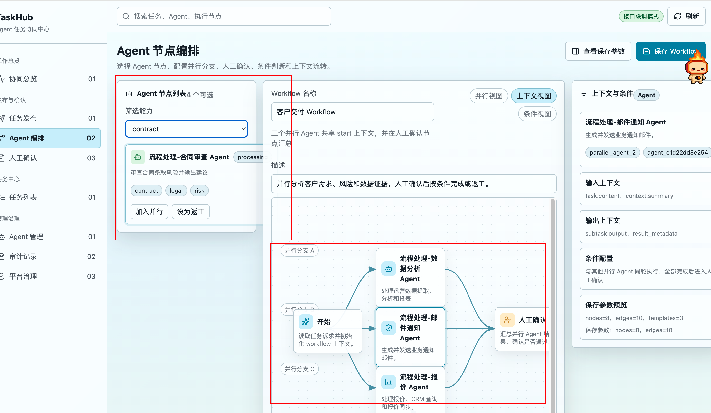

### 4. 本次修改内容

| 页面/模块 | 相对上一版的变化 | 文件 |
|---|---|---|
| 三栏布局 | 响应式调整 Agent 列表、画布、上下文面板宽度，避免区域重叠 | `frontend/src/styles.css` |
| 画布拖拽 | 节点增加 pointer 事件处理，拖动后动态更新节点坐标 | `frontend/src/WorkflowBuilderPage.tsx` |
| 连线路径 | 连线根据当前节点坐标重新计算 | `frontend/src/workflowCanvas.ts` |
| 节点文字 | 标题和描述增加换行、限高和溢出处理 | `frontend/src/styles.css` |
| 测试 | 增加拖拽边界和动态连线路径测试 | `frontend/src/workflowCanvas.test.ts` |

### 5. 验证记录

| 验证项 | 命令/方式 | 结果 |
|---|---|---|
| 前端测试 | `npm test` | 通过 |
| React 构建 | `npm run build` | 通过 |
| 浏览器检查 | 在 `Agent 编排` 页面检查节点区域、画布滚动和拖拽 | 通过 |

### 6. 剩余问题

- 本轮仍保留并行视图、上下文视图、条件视图切换；后续按用户要求改为完全根据画布节点生成。

## 2026-07-15：Agent 编排自由画布、节点增删和缩放

### 1. 触发问题

- 用户问题：画布节点要支持新增和删除，不要并行视图、上下文视图、串行视图，直接根据画布中的节点即可；画布要支持无限空间，可以放大和缩小。
- 模型理解：编排页应从“预设视图展示”升级为“以画布当前节点和连线为准”的编辑器；用户从左侧 Agent 列表加入节点，也可以新增人工/条件节点并删除选中节点。
- 本轮目标：移除视图切换，增加节点增删、缩放、大画布滚动和自动扩容能力。

### 2. 用户原始提问（逐字）

```text
画布中的节点要支持新增和删除，不要并行视图、上下文视图、串行视图，直接根据画布中的节点来即可，画布要支持无限空间，可以放大和缩小
```

### 3. 上一版状态

- 涉及页面：Agent 编排页。
- 上一版状态：画布以预设并行/上下文/条件视图展示为主，左侧 Agent 只能加入并行或设为返工，画布节点不能自由新增和删除。

### 4. 本次修改内容

| 页面/模块 | 相对上一版的变化 | 文件 |
|---|---|---|
| Agent 列表 | Agent 卡片操作改为“加入画布”，支持同一 Agent 多次加入形成不同节点 | `frontend/src/WorkflowBuilderPage.tsx` |
| 画布工具栏 | 新增“人工节点”“条件节点”“删除选中”和缩放按钮 | `frontend/src/WorkflowBuilderPage.tsx` |
| 视图切换 | 移除并行视图、上下文视图、条件视图按钮，保存参数直接来自当前 `nodes` 和 `edges` | `frontend/src/WorkflowBuilderPage.tsx` |
| 节点删除 | 删除选中节点时同步删除相关连线，开始/结束节点不可删除 | `frontend/src/WorkflowBuilderPage.tsx`、`frontend/src/workflowCanvas.ts` |
| 画布缩放 | 通过内部 stage 缩放，拖拽位移按缩放比例换算 | `frontend/src/WorkflowBuilderPage.tsx`、`frontend/src/styles.css` |
| 无限画布 | 初始大画布支持滚动，节点新增或拖到边缘时自动扩容 | `frontend/src/WorkflowBuilderPage.tsx`、`frontend/src/workflowCanvas.ts` |
| 条件节点 | 动态新增的 `condition_*` 节点使用条件节点尺寸和样式 | `frontend/src/workflowCanvas.ts`、`frontend/src/styles.css` |
| 测试 | 增加动态条件节点尺寸、删除节点连线和画布扩容测试 | `frontend/src/workflowCanvas.test.ts` |

### 5. 页面效果截图

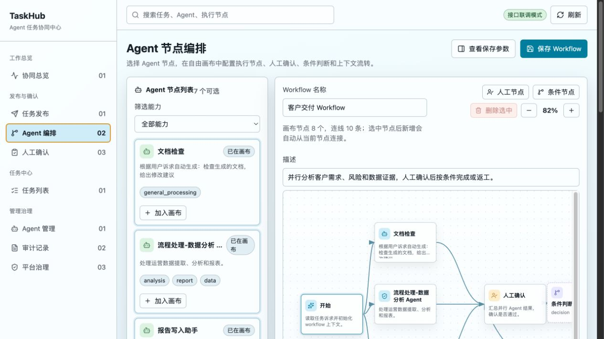

### 6. 验证记录

| 验证项 | 命令/方式 | 结果 |
|---|---|---|
| 前端测试 | `npm test` | 2 个测试文件，7 个测试通过 |
| React 构建 | `npm run build` | 通过 |
| 浏览器交互 | 检查旧视图切换数量为 0，节点可新增/删除，缩放从 82% 到 92%，画布滚动尺寸大于可视区 | 通过 |
| 浏览器拖拽 | 节点坐标从 `558.043px / 263.739px` 变化为 `494.996px / 233.3px` | 通过 |
| 控制台错误 | 浏览器 error 日志检查 | 空 |

### 7. 剩余问题

- 当前新增节点会自动从选中节点连一条默认边；后续如果需要手工连线、端口选择、撤销重做和框选能力，可再升级为 React Flow 或 AntV X6。

## 2026-07-15：Agent 编排改造为 React Flow 大弹窗

### 1. 触发问题

- 用户问题：选择方案 C，要求用 React Flow 改造 Agent 编排；同时去掉独立菜单，在任务发布的大弹窗中完成编排和提交。
- 模型理解：上一版是自研轻量画布，不是 React Flow；本轮需要引入 `@xyflow/react`，把编排能力内嵌到任务发布流程，并让后端保存当次编排快照，保证任务执行中不受模板后续修改影响。
- 本轮目标：React Flow 画布、任务发布弹窗、Agent 执行交代、提交任务、连接完成节点、任务名称和 Workflow 快照保存一次完成。

### 2. 用户原始提问（逐字）

```text
当前的画布不是用的React Flow吗？
```

```text
用方案C
```

### 3. 上一版状态

- 涉及页面：任务发布页、Agent 编排页、任务列表。
- 上一版状态：Agent 编排是独立菜单页，画布为自研 `button + svg path + PointerEvent` 实现；任务发布选择已保存模板 ID，任务执行时后端运行时读取模板。

### 4. 本次修改内容

| 页面/模块 | 相对上一版的变化 | 文件 |
|---|---|---|
| 左侧菜单 | 移除独立 `Agent 编排` 菜单 | `frontend/src/App.tsx` |
| 任务发布页 | 新增必填任务名称；选择 Agent 编排后打开大弹窗 | `frontend/src/App.tsx` |
| Agent 编排画布 | 引入 `@xyflow/react`，使用 React Flow 节点、边、拖拽、缩放、MiniMap 和 Controls | `frontend/src/WorkflowBuilderPage.tsx`、`frontend/package.json` |
| Agent 执行交代 | 选中 Agent 节点后可填写 `execution_instruction`，随节点 config 保存 | `frontend/src/WorkflowBuilderPage.tsx`、`frontend/src/workflowReactFlow.ts` |
| 完成节点连接 | 新增“连接到完成”按钮，当前节点可直接连到 `end` 节点 | `frontend/src/WorkflowBuilderPage.tsx` |
| 编排提交任务 | 大弹窗内新增“提交任务”，提交当前画布 Workflow 定义并异步确认任务 | `frontend/src/App.tsx` |
| API 参数 | `createTaskRequest` 支持 `title` 和嵌套 `metadata.workflow_definition` | `frontend/src/api/taskhub.ts`、`app/core/models.py` |
| Workflow 快照 | 创建任务时保存 `workflow_definition` 快照，执行时优先读取任务快照，不再依赖可变模板 | `app/services/task_service.py` |
| 测试 | 新增任务名称、Workflow 快照和 React Flow helper 测试 | `tests/test_tasks.py`、`tests/test_workflows.py`、`frontend/src/workflowReactFlow.test.ts` |

### 5. 页面效果截图

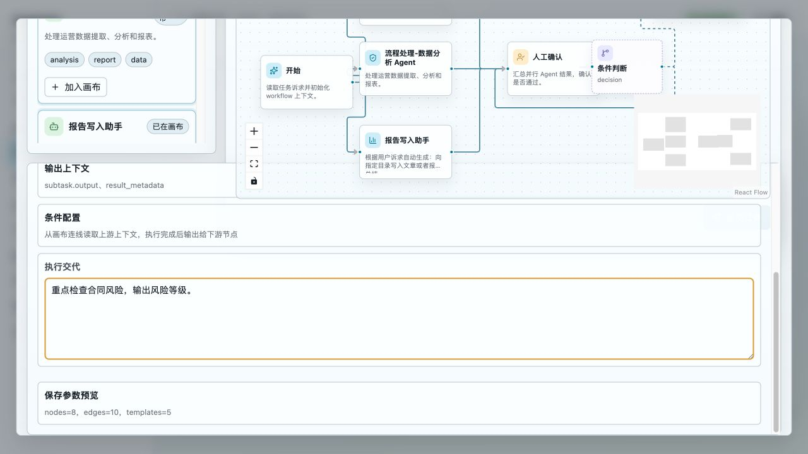

### 6. 验证记录

| 验证项 | 命令/方式 | 结果 |
|---|---|---|
| 前端测试 | `npm test` | 3 个测试文件，9 个测试通过 |
| React 构建 | `npm run build` | 通过 |
| 后端测试 | `.venv/bin/pytest -q` | 67 个测试通过，1 个第三方 deprecation warning |
| 浏览器检查 | 打开任务发布页，选择 Agent 编排，打开大弹窗 | 左侧无 Agent 编排菜单；弹窗存在 React Flow；节点 8 个、边 10 条 |
| 执行交代 | 选中 Agent 节点填写执行要求 | 可写入并保留在输入框 |
| 控制台错误 | 浏览器 error 日志检查 | 空 |

### 7. 剩余问题

- 当前 React Flow 已支持拖拽、缩放、连接和删除节点；还没有做撤销重做、边条件可视化编辑、框选、多选批量删除。后续可继续在 React Flow 能力上迭代。

## 2026-07-15：移除完成节点快捷连接按钮

### 1. 触发问题

- 用户问题：Agent 画布节点之间是否可以通过拖动连接；如果可以，去掉“连接到完成”按钮。
- 模型理解：当前 React Flow 画布已经通过节点 `Handle` 和 `onConnect` 支持拖动连线，“连接到完成”按钮属于重复入口。
- 本轮目标：保留 React Flow 拖动连线能力，移除冗余快捷按钮，简化画布工具栏。

### 2. 用户原始提问（逐字）

```text
现在agent画布上，节点与节点之间的连接，可以通过拖动连接的方式连接吗？可以的话去掉连接到完成的这个按钮吧
```

### 3. 本次修改内容

| 页面/模块 | 相对上一版的变化 | 文件 |
|---|---|---|
| Agent 编排弹窗 | 移除工具栏中的“连接到完成”按钮 | `frontend/src/WorkflowBuilderPage.tsx` |
| 连线交互 | 保留 React Flow 节点左右连接点，继续通过拖动连接节点 | `frontend/src/WorkflowBuilderPage.tsx` |

### 4. 验证记录

| 验证项 | 命令/方式 | 结果 |
|---|---|---|
| 前端测试 | `npm test` | 通过 |
| React 构建 | `npm run build` | 通过 |

### 5. 剩余问题

- 目前拖动连线会生成普通连线；条件边的规则编辑仍需后续在 React Flow 边配置面板中补充。

## 2026-07-15：合并后恢复 Agent 编排弹窗

### 1. 触发问题

- 用户问题：合并代码解决冲突后，本地 Agent 编排相关修改被覆盖，需要在拉取后的代码基础上修复。
- 模型理解：当前拉取版本已经切到 Ant Design 页面，但任务发布页只剩流程模板下拉，React Flow 编排弹窗和 inline `workflow_definition` 提交能力没有接回；同时本地依赖缺少 `antd`，后端存在合并后重复 `title` 参数。
- 本轮目标：保留当前 Ant Design 页面设计，在任务发布页恢复大弹窗 Agent 编排入口，修复前后端类型和测试基线。

### 2. 用户原始提问（逐字）

```text
刚才合并代码解决冲突，本地修改的代码被覆盖了，在拉取代码的基础上进行修复
```

### 3. 本次修改内容

| 页面/模块 | 相对上一版的变化 | 文件 |
|---|---|---|
| 任务发布页 | 在 Ant Design 表单中恢复“打开 Agent 编排”入口，通过大弹窗加载 React Flow 编排页 | `frontend/src/App.tsx` |
| 编排任务提交 | 画布提交时直接携带 `metadata.workflow_definition` 创建任务，并异步确认执行 | `frontend/src/App.tsx`、`frontend/src/api/taskhub.ts` |
| Workflow API 类型 | 恢复 `WorkflowNode`、`WorkflowEdge`、`WorkflowDefinition`、`createWorkflow` 和嵌套 metadata payload | `frontend/src/api/taskhub.ts` |
| 弹窗样式 | 增加 Ant Design Modal 下的编排弹窗高度、滚动和画布尺寸控制，避免按钮/文本被遮挡 | `frontend/src/styles.css` |
| 后端 metadata | `TaskRequestCreate.metadata` 和 `Task.request_metadata` 支持嵌套 workflow 定义对象 | `app/core/models.py` |
| 后端任务创建 | 修复合并冲突造成的重复 `title` 参数，任务名称保存在 `task.title`，draft 保留识别任务清单 | `app/services/task_service.py`、`tests/test_tasks.py` |
| 前端测试 | 将合并后的脚本式测试改成 Vitest 测试，并新增 inline workflow payload 断言 | `frontend/tests/taskRequestPayload.test.ts`、`frontend/tests/intentDrafts.test.ts` |

### 4. 验证记录

| 验证项 | 命令/方式 | 结果 |
|---|---|---|
| 前端 payload 红灯 | `npm test -- tests/taskRequestPayload.test.ts` | inline workflow_definition 用例先失败，确认覆盖问题存在 |
| 前端测试 | `npm test` | 5 个测试文件，13 个测试通过 |
| React 构建 | `npm run build` | 通过；Vite 仅提示 chunk 体积 warning |
| 后端重点测试 | `.venv/bin/pytest -q tests/test_tasks.py tests/test_workflows.py` | 21 个测试通过，1 个第三方 deprecation warning |
| 后端全量测试 | `.venv/bin/pytest -q` | 69 个测试通过，1 个第三方 deprecation warning |

### 5. 剩余问题

- 本轮以合并后恢复为主，未新增浏览器截图；后续如继续调整 UI 细节，应再补充弹窗截图。

## 2026-07-15：Agent 编排画布布局扩展与节点 Hover 详情

### 1. 触发问题

- 用户问题：Agent 编排时节点列表要窄一点，画布面积要大一点，最右侧节点描述可以去掉；鼠标移动到画布节点上时展示透明好看的节点详情。
- 模型理解：编排页主操作是画布，需要减少两侧信息占用；节点详情从固定右栏改为按需 hover 浮层，保留节点信息但不压缩画布。
- 本轮目标：将 Agent 编排弹窗改为左侧节点列表 + 大画布两栏结构，并给画布节点增加半透明详情浮层。

### 2. 用户原始提问（逐字）

```text
在agent画布编排的时候，节点列表要窄一点，画布占的面积要大一点，最右侧的节点描述可以去掉，当鼠标移动到画布的节点上时，可以展示出节点的详情信息，可以做透明好看
```

### 3. 本次修改内容

| 页面/模块 | 相对上一版的变化 | 文件 |
|---|---|---|
| Agent 编排布局 | 三栏改为两栏，左侧 Agent 列表收窄，画布占据剩余主要空间 | `frontend/src/styles.css` |
| 右侧详情 | 移除固定的“上下文与条件”右侧详情栏 | `frontend/src/WorkflowBuilderPage.tsx` |
| 节点详情 | 画布节点内新增 hover 详情浮层，展示类型、节点 ID、描述、Agent ID 和执行交代 | `frontend/src/WorkflowBuilderPage.tsx`、`frontend/src/workflowReactFlow.ts` |
| Agent 执行交代 | 选中 Agent 时保留底部执行交代输入，不再放在右侧详情栏 | `frontend/src/WorkflowBuilderPage.tsx`、`frontend/src/styles.css` |
| 测试 | 新增节点 hover 详情文案 helper 测试 | `frontend/src/workflowReactFlow.test.ts` |

### 4. 验证记录

| 验证项 | 命令/方式 | 结果 |
|---|---|---|
| 节点详情测试红灯 | `npm test -- src/workflowReactFlow.test.ts` | 新增 helper 前失败，确认测试有效 |
| 节点详情测试 | `npm test -- src/workflowReactFlow.test.ts` | 3 个测试通过 |
| 前端测试 | `npm test` | 5 个测试文件，14 个测试通过 |
| React 构建 | `npm run build` | 通过；Vite 仅提示 chunk 体积 warning |
| 浏览器布局检查 | 打开 Agent 编排弹窗读取布局尺寸 | 左侧约 224px；右侧详情栏不存在；画布列占剩余宽度 |

### 5. 剩余问题

- 本轮 hover 详情先展示基础节点信息；条件边规则的可视化编辑仍需后续单独设计。

## 2026-07-15：修复 Agent 节点详情浮层被遮挡

### 1. 触发问题

- 用户问题：Agent 画布节点详情浮层会被其他节点遮挡。
- 模型理解：详情浮层虽然在节点内部提高了 z-index，但 React Flow 节点外层本身仍处在较低堆叠层级，兄弟节点可能盖住浮层；同时浮层透明度偏低，下面节点内容透出后影响阅读。
- 本轮目标：悬停节点时提升 React Flow 外层节点层级，并增强浮层可读性。

### 2. 用户原始提问（逐字）

```text
节点的详情的会被其他节点遮挡
```

### 3. 本次修改内容

| 页面/模块 | 相对上一版的变化 | 文件 |
|---|---|---|
| React Flow 节点层级 | 通过 `onNodeMouseEnter/onNodeMouseLeave` 标记悬停节点，并给外层节点增加高层级 class | `frontend/src/WorkflowBuilderPage.tsx` |
| Hover 浮层样式 | 悬停节点外层 `z-index` 提升到 1000，浮层背景从 0.78 提高到 0.92，阴影和 blur 增强 | `frontend/src/styles.css` |

### 4. 验证记录

| 验证项 | 命令/方式 | 结果 |
|---|---|---|
| 前端测试 | `npm test` | 5 个测试文件，14 个测试通过 |
| React 构建 | `npm run build` | 通过；Vite 仅提示 chunk 体积 warning |

### 5. 剩余问题

- 后续如果浮层靠近画布右边界，可继续增加自动左右翻转定位。

## 2026-07-15：Agent 节点列表状态与人工/条件节点配置

### 1. 触发问题

- 用户问题：节点列表“已在画布”文字超出或换行，需要调小并美观展示；人工确认节点要能指定人员和添加交代；条件节点要能增加条件描述和内容。
- 模型理解：Agent 列表需要适配更窄栏宽；节点配置需要随 workflow_definition 一起保存，而不是只显示在 UI 中。
- 本轮目标：优化节点列表状态胶囊，增加人工节点与条件节点的编辑配置，并在 hover 详情中展示配置内容。

### 2. 用户原始提问（逐字）

```text
节点列表的这个是否已在画布按钮调整下，文字调小，要在按钮内能展示，不要超出，要美观；人工确认节点要能指定对应的人员，要有添加交代的地方；条件节点要能增加条件描述信息和内容；
```

### 3. 本次修改内容

| 页面/模块 | 相对上一版的变化 | 文件 |
|---|---|---|
| Agent 节点列表 | “已在画布”状态改成 11px 单行胶囊，固定宽高，避免换行和溢出 | `frontend/src/styles.css` |
| 人工确认节点 | 选中人工节点后可填写指定人员和人工交代，保存到 `config.assignee`、`config.handoff_instruction` | `frontend/src/WorkflowBuilderPage.tsx` |
| 条件节点 | 选中条件节点后可填写条件描述和条件内容，保存到 `config.condition_description`、`config.condition_content` | `frontend/src/WorkflowBuilderPage.tsx` |
| 节点详情 | hover 详情支持展示人员、条件描述、条件内容和交代 | `frontend/src/workflowReactFlow.ts` |
| 测试 | 增加节点配置写入和详情展示测试 | `frontend/src/workflowReactFlow.test.ts` |

### 4. 验证记录

| 验证项 | 命令/方式 | 结果 |
|---|---|---|
| 节点配置测试红灯 | `npm test -- src/workflowReactFlow.test.ts` | 新增 helper 和详情字段实现前失败 |
| 前端测试 | `npm test` | 5 个测试文件，16 个测试通过 |
| React 构建 | `npm run build` | 通过；Vite 仅提示 chunk 体积 warning |
| 浏览器检查 | 打开 Agent 编排弹窗并读取 UI 状态 | “已在画布”11px 单行；人工/条件配置面板均出现 |

### 5. 剩余问题

- 目前“指定人员”为自由输入；后续如有用户/组织接口，可改成下拉选择或搜索选择。

## 2026-07-15：Agent 画布人工/条件节点双击内联编辑

### 1. 触发问题

- 用户问题：能直接在画布的人工节点和条件判断节点中可以双击输入信息吗？
- 模型理解：现有人工/条件节点配置主要依赖画布下方表单，用户希望在画布节点上直接完成核心信息录入，减少视线切换。
- 本轮目标：人工节点和条件判断节点支持双击进入节点内编辑态，输入内容直接同步到 workflow 节点配置，并保留最终任务提交保存数据。

### 2. 用户原始提问（逐字）

```text
能直接在画布的人工节点和条件判断节点中可以双击输入信息吗？
```

### 3. 本次修改内容

| 页面/模块 | 相对上一版的变化 | 文件 |
|---|---|---|
| React Flow 节点数据 | 增加人工/条件节点内联可编辑字段定义，明确字段写回的 `config` key | `frontend/src/workflowReactFlow.ts` |
| Agent 编排画布 | 人工节点、条件判断节点双击后展示节点内编辑表单，输入立即同步到画布数据和提交数据 | `frontend/src/WorkflowBuilderPage.tsx` |
| 节点交互样式 | 增加半透明节点内编辑卡片、编辑态宽度、输入框聚焦样式，并在编辑时隐藏 hover 详情避免遮挡 | `frontend/src/styles.css` |
| 测试 | 增加人工/条件节点内联编辑字段契约测试 | `frontend/src/workflowReactFlow.test.ts` |

### 4. 验证记录

| 验证项 | 命令/方式 | 结果 |
|---|---|---|
| 内联字段测试红灯 | `npm test -- src/workflowReactFlow.test.ts` | 新增 helper 实现前失败：`workflowNodeInlineEditFields is not a function` |
| 内联字段测试绿灯 | `npm test -- src/workflowReactFlow.test.ts` | 1 个测试文件，6 个测试通过 |
| 前端完整测试 | `npm test` | 5 个测试文件，17 个测试通过 |
| React 构建 | `npm run build` | 通过；Vite 仅提示 chunk 体积 warning |
| 浏览器检查 | 打开任务发布页 Agent 编排弹窗，双击人工节点和条件节点输入 | 人工节点可输入指定人员/人工交代并关闭编辑态；条件节点可输入条件描述/条件内容，内容同步到底部配置面板 |

### 5. 剩余问题

- 当前为自由输入；如后续接入用户/组织数据，人工节点“指定人员”可升级为搜索选择。

## 2026-07-15：Agent 节点列表能力筛选下拉中文化

### 1. 触发问题

- 用户问题：画布的节点列表下拉框，现在出现的都是英文，改成中文。
- 模型理解：Agent 编排弹窗左侧“筛选能力”下拉框直接展示 capability 英文字段，不符合中文操作界面。
- 本轮目标：下拉框展示中文能力名称，同时保留原 capability value，避免影响现有筛选逻辑。

### 2. 用户原始提问（逐字）

```text
画布的节点列表下拉框，现在出现的都是英文，改成中文
```

### 3. 本次修改内容

| 页面/模块 | 相对上一版的变化 | 文件 |
|---|---|---|
| 能力名称展示 | 新增 capability 中文映射，覆盖通用处理、数据分析、报告撰写、邮件通知、报价、合同审查等常见能力 | `frontend/src/workflowLabels.ts` |
| Agent 节点列表 | “筛选能力”下拉框使用中文 label，option value 仍保留原英文 capability | `frontend/src/WorkflowBuilderPage.tsx` |
| 测试 | 增加 capability 中文映射和未知值兜底测试 | `frontend/src/workflowLabels.test.ts` |

### 4. 页面效果截图对比

说明：为便于截图对比，下图使用临时渲染方式将原生下拉框展开成列表；真实页面仍保持正常下拉交互。

| 修改前 | 修改后 |
|---|---|
| 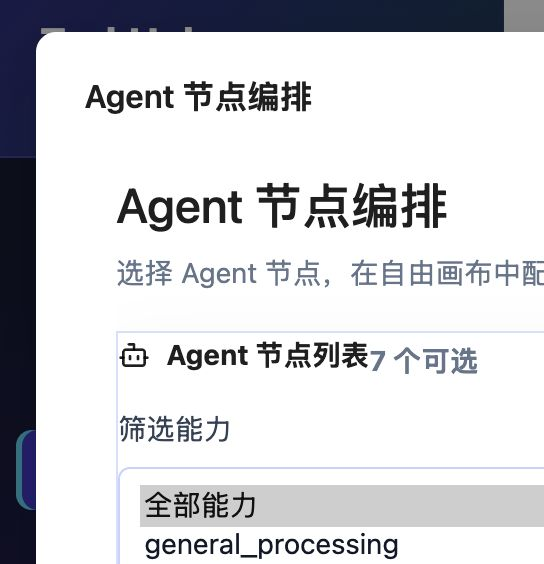 |  |

### 5. 验证记录

| 验证项 | 命令/方式 | 结果 |
|---|---|---|
| 能力名称测试红灯 | `npm test -- src/workflowLabels.test.ts` | 新 helper 实现前失败：找不到 `./workflowLabels` |
| 能力名称测试绿灯 | `npm test -- src/workflowLabels.test.ts` | 1 个测试文件，2 个测试通过 |
| 前端完整测试 | `npm test` | 6 个测试文件，19 个测试通过 |
| React 构建 | `npm run build` | 通过；Vite 仅提示 chunk 体积 warning |

### 6. 剩余问题

- Agent 卡片上的能力标签仍展示原 capability 值；本轮只处理用户指出的下拉框。

## 后续迭代记录模板

以后每次修改前端，请复制以下模板追加到已有迭代记录之后；不要回改已经落档的历史迭代。

```markdown
## YYYY-MM-DD：迭代标题

### 1. 触发问题

- 用户问题：
- 模型理解：
- 本轮目标：

### 2. 用户原始提问（逐字）

```text

```

### 3. 与模型的关键问答

| 轮次 | 用户问题 | 模型处理 |
|---|---|---|
| 1 | 见“用户原始提问（逐字）”第 1 条 |  |

### 4. 上一版状态

- 涉及页面：
- 上一版来源：
- 上一版状态：
- 上一版截图：


### 5. 本次修改内容

| 页面/模块 | 相对上一版的变化 | 文件 |
|---|---|---|
|  |  |  |

### 6. 页面效果截图对比

| 上一版 | 本次迭代后 |
|---|---|
|  |  |

### 7. 验证记录

| 验证项 | 命令/方式 | 结果 |
|---|---|---|
| JS 语法 |  |  |
| 锚点覆盖 |  |  |
| 截图检查 |  |  |

### 8. 剩余问题

- 
```
## 2026-07-16 流程编排画布抽屉改造

### 改造内容

- Agent 节点编排页打开时不再自动生成业务默认流程，改为新画布，仅保留基础开始/完成节点。
- 编排页布局调整为左侧主画布、右侧抽屉组。
- 右侧新增两个可收起区域：
  - 可编排节点：展示当前所有可加入画布的节点，点击后加入画布。
  - 流程模板：展示已保存 Workflow 模板，点击后按模板定义渲染到画布。
- 流程模板渲染增加自动布局兜底，未保存坐标的节点会按连线层级排布，避免重叠在画布原点。

### 验证

- `npm run build`：通过，仍保留 Vite chunk 体积提示。

## 2026-07-16 流程编排左侧抽屉调整

### 改造内容

- 可编排节点抽屉、流程模板抽屉移动到画布左侧。
- 两个抽屉默认收起，展开后在左侧展示列表内容。
- 移除右侧节点配置面板，画布右侧不再展示配置区域。
- 保留节点自身的内联编辑能力。

### 验证

- `npm run build`：通过，仍保留 Vite chunk 体积提示。

## 2026-07-16 流程编排浮层抽屉与节点尺寸调整

### 改造内容

- 左侧“可编排节点”和“流程模板”默认仅展示小图标按钮。
- 鼠标悬停通过按钮 `title` 展示按钮作用。
- 点击图标后抽屉以浮层方式覆盖在画布左侧，不再压缩画布宽度。
- 移除右侧配置区域后，画布保持完整主视图。
- 放大画布节点和条件节点默认尺寸，改善大画布下节点过小的问题。
- 抽屉入口移动到画布容器内部，避免按钮覆盖 Workflow 名称、描述等表单区域。
- ReactFlow 节点增加显式宽度配置，保证节点实际交互边界与视觉尺寸一致。

### 验证

- `npm run build`：通过，仍保留 Vite chunk 体积提示。

## 2026-07-16 用户管理与人工节点人员下拉

### 1. 触发问题

- 用户问题：需要增加用户管理，区分管理员和普通用户；人工节点编辑时通过姓名下拉选择具体人员。
- 模型理解：前端需要同时补管理入口、当前用户上下文、角色菜单过滤，以及 Agent 编排画布中的人员选择体验。
- 本轮目标：管理员可维护用户；普通用户只看自己的任务和分配给自己的人工节点；人工节点配置保存真实用户 ID、姓名和角色。

### 2. 用户原始提问（逐字）

```text
增加一个功能，用户管理，分为管理员和普通用户类型，支持新增、删除、修改用户，用户的属性要有手机号、邮箱、姓名等其他信息；管理员用户拥有所有菜单的操作和查询权限；普通用户只能查看自己发起的任务流程和详情，人工处理的时候只能处理任务节点分配给自己的任务；在人工节点编辑的时候可以通过下拉框人员姓名列表选择具体的人员，列表展示为姓名；告诉我你要怎么改
```

```text
实现吧，记得把前后端的迭代都纪录到文档中去
```

### 3. 本次修改内容

| 页面/模块 | 相对上一版的变化 | 文件 |
|---|---|---|
| 顶部工具栏 | 增加当前用户切换，下拉展示人员姓名，并显示管理员/普通用户标签 | `frontend/src/App.tsx` |
| 侧边菜单 | 管理员显示全部菜单；普通用户隐藏流程节点管理、用户管理、审计记录、平台治理 | `frontend/src/App.tsx` |
| 用户管理页 | 新增用户列表，支持新增、编辑、删除用户，字段包含姓名、手机号、邮箱、角色、部门、岗位、状态、备注 | `frontend/src/App.tsx` |
| 任务发布页 | Agent 编排弹窗传入可分配人员列表 | `frontend/src/App.tsx` |
| Agent 编排画布 | 人工节点双击编辑时，指定人员改成姓名下拉；保存 `assignee_user_id/name/role` | `frontend/src/WorkflowBuilderPage.tsx`、`frontend/src/workflowReactFlow.ts` |
| 流程节点管理 | 人工节点创建改成选择人员姓名，不再手输审批人 | `frontend/src/App.tsx` |
| 前端 API | 新增用户 CRUD、可分配人员接口、当前用户请求头 `X-User-Id` | `frontend/src/api/taskhub.ts` |

### 4. 验证记录

| 验证项 | 命令/方式 | 结果 |
|---|---|---|
| 前端 API 与 React Flow 目标测试 | `npm test -- src/api/taskhub.test.ts src/workflowReactFlow.test.ts` | 2 个测试文件，9 个测试通过 |
| 前端完整测试 | `npm test` | 7 个测试文件，22 个测试通过 |
| React 构建 | `npm run build` | 通过；Vite 仅提示 chunk 体积 warning |

### 5. 页面效果截图

| 用户管理页 | Agent 编排人工节点人员选择 |
|---|---|
|  | 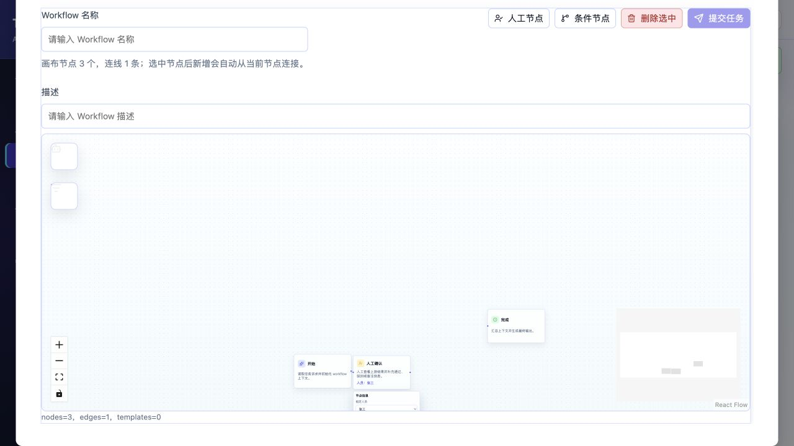 |

### 6. 剩余问题

- 当前用户通过 `X-User-Id` 请求头模拟，尚未接入登录态和 JWT。
- 用户管理页删除用户未做任务引用保护，后续可以根据真实业务决定是否改为停用优先。

## 2026-07-16 人工节点交代中文输入修复

### 1. 触发问题

- 用户问题：画布人工节点的“人工交代”中不能输入中文。
- 模型理解：中文输入法处于组合输入时，受控 `textarea` 每次变更都写回 React Flow 节点数据，可能触发重渲染并打断 IME 组合输入。
- 本轮目标：人工交代和同类内联文本输入支持中文输入法，组合输入结束后再提交到节点配置。

### 2. 用户原始提问（逐字）

```text
画布人工节点的人工交代中不能输入中文，要支持输入中文
```

### 3. 本次修改内容

| 页面/模块 | 相对上一版的变化 | 文件 |
|---|---|---|
| Agent 编排画布 | 内联文本输入增加 IME composition 缓冲，组合输入中只更新本地草稿，`compositionend` 或失焦后提交节点配置 | `frontend/src/WorkflowBuilderPage.tsx` |
| React Flow helper | 新增 `reduceWorkflowInlineTextDraft`，覆盖中文组合输入时不提前提交的行为 | `frontend/src/workflowReactFlow.ts` |
| 前端测试 | 增加中文 IME 组合输入测试，覆盖 `composition_start/change/composition_end` 流程 | `frontend/src/workflowReactFlow.test.ts` |

### 4. 验证记录

| 验证项 | 命令/方式 | 结果 |
|---|---|---|
| 目标测试红灯 | `npm test -- src/workflowReactFlow.test.ts` | 实现前失败：`reduceWorkflowInlineTextDraft is not a function` |
| 目标测试绿灯 | `npm test -- src/workflowReactFlow.test.ts` | 1 个测试文件，7 个测试通过 |
| 前端完整测试 | `npm test` | 7 个测试文件，23 个测试通过 |
| React 构建 | `npm run build` | 通过；Vite 仅提示 chunk 体积 warning |

### 5. 剩余问题

- 本轮只修复画布节点内联文本输入的中文输入法问题；Ant Design 表单输入不在问题范围内。

## 2026-07-16 Agent 编排顶部信息栏样式优化

### 1. 触发问题

- 用户问题：“查看保存参数”按钮用途不明显，希望删除；Workflow 名称、描述和操作按钮排版需要更符合当前风格。
- 模型理解：编排弹窗顶部存在无效按钮和裸露表单区域，视觉层次与当前 Ant Design 风格不一致。
- 本轮目标：删除无效按钮，压缩顶部区域高度，让 Workflow 信息、统计和画布操作更整齐。

### 2. 用户原始提问（逐字）

```text
agent画布编排页面，查看保存参数的按钮没啥用的话删掉吧，左侧红框框出来的按钮和框可以优化下样式，让拍版好看些，符合当前样式风格
```

### 3. 本次修改内容

| 页面/模块 | 相对上一版的变化 | 文件 |
|---|---|---|
| Agent 编排页标题操作区 | 删除“查看保存参数”按钮，仅保留“保存 Workflow” | `frontend/src/WorkflowBuilderPage.tsx` |
| Workflow 信息区 | 名称、描述、节点数、连线数合并为浅色信息栏，减少裸输入框割裂感 | `frontend/src/WorkflowBuilderPage.tsx`、`frontend/src/styles.css` |
| 画布操作按钮 | 人工节点、条件节点、删除选中、提交任务统一高度、边框和色彩层级 | `frontend/src/styles.css` |
| 响应式布局 | 小屏下信息栏和按钮自动换行，避免挤压 | `frontend/src/styles.css` |

### 4. 验证记录

| 验证项 | 命令/方式 | 结果 |
|---|---|---|
| 前端完整测试 | `npm test` | 7 个测试文件，23 个测试通过 |
| React 构建 | `npm run build` | 通过；Vite 仅提示 chunk 体积 warning |

### 5. 剩余问题

- 本轮只优化编排弹窗顶部表单和按钮区，未调整画布节点布局。

## 2026-07-16 操作提示自动淡出

### 1. 触发问题

- 用户问题：页面右上角操作提示词会一直展示不消失。
- 模型理解：当前 `toast` 只是字符串状态，展示后没有自动清理；样式也没有淡出动画。
- 本轮目标：提示展示短时间后自动变淡并消失，重复触发同样文案也能重新计时。

### 2. 用户原始提问（逐字）

```text
看下页面右上角的操作提示词，现在会一直展示不消失，应该展示一会暗淡消失才对
```

### 3. 本次修改内容

| 页面/模块 | 相对上一版的变化 | 文件 |
|---|---|---|
| 全局操作提示 | `toast` 从字符串改为带 id 的消息对象，每次触发重新计时 | `frontend/src/App.tsx` |
| toast 状态 | 新增自动消失时长、消息创建和定时清理判断 helper | `frontend/src/toastState.ts` |
| toast 样式 | 增加入场和延迟淡出动画，最终由定时器移除 DOM | `frontend/src/styles.css` |
| 前端测试 | 新增 toast 状态测试，覆盖消息创建、同一计时器只清理对应消息、自动消失时长范围 | `frontend/src/toastState.test.ts` |

### 4. 验证记录

| 验证项 | 命令/方式 | 结果 |
|---|---|---|
| 目标测试红灯 | `npm test -- src/toastState.test.ts` | 实现前失败：找不到 `./toastState` |
| 目标测试绿灯 | `npm test -- src/toastState.test.ts` | 1 个测试文件，3 个测试通过 |
| 前端完整测试 | `npm test` | 8 个测试文件，26 个测试通过 |
| React 构建 | `npm run build` | 通过；Vite 仅提示 chunk 体积 warning |

### 5. 剩余问题

- 当前仍使用自定义 toast；后续如果统一 Ant Design `message` 组件，可再替换实现。

## 2026-07-16 生命周期 Agent 能力标签中文化

### 1. 触发问题

- 用户要求重新生成覆盖“需求到研发、上线、运维”的 Agent 节点。
- 新 Agent 使用更细的 capability 标识，如果前端不补中文映射，画布左侧筛选和节点标签会回退显示英文。

### 2. 用户原始提问（逐字）

```text
现在数据库中的anget节点不太行，都删掉吧，帮我生成一批agent节点，覆盖从需求到研发、上线、运维的场景
```

### 3. 本次修改内容

| 页面/模块 | 相对上一版的变化 | 文件 |
|---|---|---|
| Agent 画布节点列表 | 新增生命周期 Agent 的 capability 中文标签 | `frontend/src/workflowLabels.ts` |
| 前端测试 | 覆盖需求分析、监控告警等新增标签，避免回退英文 | `frontend/src/workflowLabels.test.ts` |

### 4. 验证记录

| 验证项 | 命令/方式 | 结果 |
|---|---|---|
| 目标测试红灯 | `npm test -- src/workflowLabels.test.ts` | 实现前失败：`requirement_analysis` 显示为 `requirement analysis` |
| 目标测试绿灯 | `npm test -- src/workflowLabels.test.ts` | 1 个测试文件，2 个测试通过 |

### 5. 剩余问题

- 本轮只补 capability 中文展示；Agent 卡片图标仍沿用当前通用 Agent 图标逻辑，后续可读取 `metadata.icon` 做个性化展示。

## 2026-07-16 Agent 编排资源侧栏与流程模板交互优化

### 1. 触发问题

- 用户反馈 Agent 编排页里“流程模板”展示有问题：
  - 点击反馈不明显。
  - 模板面板遮挡画布。
  - “可编排节点”和“流程模板”的抽屉样式不好看、不直观。
- 根因：旧实现把两个抽屉以绝对定位浮在 React Flow 画布上，展开后会覆盖节点和画布控件；模板只有小按钮能触发加载，卡片本身缺少点击态。

### 2. 用户原始提问（逐字）

```text
agent画布编排页面，流程模版的展示，有问题吧，点击无效果，展示也遮挡了；还有可编排节点和流程模版的抽屉效果太丑，不好看，也不直观，
```

### 3. 本次修改内容

| 页面/模块 | 相对上一版的变化 | 文件 |
|---|---|---|
| Agent 编排画布 | 左侧浮层抽屉改为固定资源侧栏，画布和资源栏不再互相遮挡 | `frontend/src/WorkflowBuilderPage.tsx`、`frontend/src/styles.css` |
| 资源切换 | “可编排节点 / 流程模板”改为顶部 tab 切换，替代两个独立抽屉按钮 | `frontend/src/WorkflowBuilderPage.tsx`、`frontend/src/styles.css` |
| 流程模板 | 模板卡片整卡可点击，点击后加载到画布并展示选中态 | `frontend/src/WorkflowBuilderPage.tsx` |
| 模板文案 | 新增模板卡片 view helper，状态、节点数、连线数改成中文可读展示 | `frontend/src/workflowTemplateCard.ts` |
| 前端测试 | 新增模板卡片文案测试，补充 `quality_gate` 中文能力标签测试 | `frontend/src/workflowTemplateCard.test.ts`、`frontend/src/workflowLabels.test.ts` |

### 4. 验证记录

| 验证项 | 命令/方式 | 结果 |
|---|---|---|
| 目标测试红灯 | `npm test -- src/workflowTemplateCard.test.ts` | 实现前失败：找不到 `./workflowTemplateCard` |
| 目标测试绿灯 | `npm test -- src/workflowTemplateCard.test.ts` | 1 个测试文件，1 个测试通过 |
| 编排相关测试 | `npm test -- src/workflowReactFlow.test.ts` | 1 个测试文件，7 个测试通过 |
| 前端完整测试 | `npm test` | 9 个测试文件，27 个测试通过 |
| React 构建 | `npm run build` | 通过；Vite 仅提示 chunk 体积 warning |
| 浏览器验证 | 打开 Agent 编排弹窗，切换“流程模板”，点击第一张模板卡片 | 加载后画布显示 5 个节点、4 条连线，卡片有选中态，侧栏不遮挡画布 |

### 5. 剩余问题

- 历史模板中部分节点标题仍是旧数据里的 `start`、`end`，本轮只优化模板展示和加载交互，未迁移历史模板内容。

## 2026-07-16 Agent 编排资源列表遮挡修复

### 1. 触发问题

- 用户反馈 Agent 画布左侧“可编排节点列表”和“流程模板列表”里，元素之间仍然有遮挡。
- 根因：资源侧栏内部仍使用两层 grid 分配高度，实际内容包含标题、说明、筛选和列表多段区域，列表滚动高度在部分视口下会计算不稳定，导致卡片被压缩或看起来互相遮挡。

### 2. 用户原始提问（逐字）

```text
agent画布的可编排节点列表和流程模版列表，元素之间都有遮挡
```

### 3. 本次修改内容

| 页面/模块 | 相对上一版的变化 | 文件 |
|---|---|---|
| 资源侧栏结构 | 将标题/说明/筛选收拢为固定 toolbar，列表单独占剩余高度 | `frontend/src/WorkflowBuilderPage.tsx` |
| 资源侧栏样式 | 从 grid 高度分配改为 flex 列布局，列表内部滚动 | `frontend/src/styles.css` |
| Agent 卡片 | 增加最小高度和稳定内部排版，避免卡片内容被压缩 | `frontend/src/styles.css` |
| 流程模板卡片 | 保持独立最小高度，避免模板卡片文字和标签互相遮挡 | `frontend/src/styles.css` |

### 4. 验证记录

| 验证项 | 命令/方式 | 结果 |
|---|---|---|
| 前端完整测试 | `npm test` | 9 个测试文件，27 个测试通过 |
| React 构建 | `npm run build` | 通过；Vite 仅提示 chunk 体积 warning |
| 浏览器验证-可编排节点 | 检查前 6 个 Agent 卡片位置和高度 | 卡片之间 `overlaps=false`，列表位于 toolbar 下方 |
| 浏览器验证-流程模板 | 检查前 5 个模板卡片位置和高度 | 卡片之间 `overlaps=false`，卡片内容未裁切 |

### 5. 剩余问题

- 当前侧栏宽度仍固定为 292px；如果后续要展示更多字段，可再做可拖拽宽度或详情弹层。

## 2026-07-16 流程模板卡片描述遮挡修复

### 1. 触发问题

- 用户反馈流程模板列表中，卡片内部的文字描述仍有遮挡。
- 根因：模板卡片复用了通用 Agent 卡片描述样式，描述区没有固定行高和高度；模板卡片高度较低时，描述和底部“节点/连线”标签容易挤压。

### 2. 用户原始提问（逐字）

```text
流程模版列表中卡片里面的文字描述有遮挡
```

### 3. 本次修改内容

| 页面/模块 | 相对上一版的变化 | 文件 |
|---|---|---|
| 模板卡片描述 | 增加固定行高、两行描述高度和换行规则 | `frontend/src/styles.css` |
| 模板卡片布局 | 增加模板卡片最小高度，标题、描述、标签三段各占固定区域 | `frontend/src/styles.css` |
| 通用卡片描述 | 补充稳定 `line-height`，避免不同浏览器默认行高造成裁切 | `frontend/src/styles.css` |

### 4. 验证记录

| 验证项 | 命令/方式 | 结果 |
|---|---|---|
| 前端完整测试 | `npm test` | 9 个测试文件，27 个测试通过 |
| React 构建 | `npm run build` | 通过；Vite 仅提示 chunk 体积 warning |
| 浏览器验证 | 检查前 5 张模板卡片描述和标签位置 | 描述与标签间距约 18px，标签未溢出卡片 |

### 5. 剩余问题

- 模板描述仍限制为最多两行展示；完整描述可后续通过 hover tooltip 或详情弹层展示。

## 2026-07-16 任务类型列表与详情差异化展示

### 1. 触发问题

- 用户要求任务列表增加“任务类型”字段，区分“手动编排”和“自动规划”。
- 用户要求不同任务类型在详情页展示不同内容：手动编排任务不展示执行轮次，改为展示手动编排流程。

### 2. 用户原始提问（逐字）

```text
在任务列表中加一个字段，任务类型：手动编排和自动规划，不同的任务类型在任务详情中也要不同，比如手动编排的任务类型没有执行轮次，有手动编排流程。告诉我你要怎么改
```

### 3. 本次修改内容

| 页面/模块 | 相对上一版的变化 | 文件 |
|---|---|---|
| 任务 API 类型 | `Task` 增加 `task_type` 和 `request_metadata.workflow_definition` 类型声明 | `frontend/src/api/taskhub.ts` |
| 任务类型 helper | 新增任务类型推断、中文标签和手动编排判断，兼容旧 `workflow_template` 数据 | `frontend/src/taskType.ts` |
| 任务列表 | 新增“任务类型”列，展示“手动编排/自动规划”标签 | `frontend/src/App.tsx` |
| 任务详情 | 自动规划任务保留“执行轮次”；手动编排任务展示“手动编排流程” | `frontend/src/App.tsx` |
| 手动编排流程样式 | 增加流程节点卡片、连线摘要、节点状态和滚动区域样式 | `frontend/src/styles.css` |

### 4. 验证记录

| 验证项 | 命令/方式 | 结果 |
|---|---|---|
| 目标测试红灯 | `npm test -- taskType.test.ts` | 实现前失败：找不到 `./taskType` |
| 目标测试绿灯 | `npm test -- taskType.test.ts taskhub.test.ts` | 2 个测试文件，5 个测试通过 |
| 前端完整测试 | `npm test` | 10 个测试文件，29 个测试通过 |
| React 构建 | `npm run build` | 通过；Vite 仅提示 chunk 体积 warning |
| 浏览器验证-列表 | 打开任务列表页 | 表头包含“任务类型”，任务行展示“手动编排/自动规划” |
| 浏览器验证-手动编排详情 | 打开手动编排任务详情 | 展示“手动编排流程”，不展示“执行轮次”，流程节点卡片正常 |
| 浏览器验证-自动规划详情 | 打开自动规划任务详情 | 展示“执行轮次”，不展示“手动编排流程” |

### 5. 剩余问题

- 详情页里的手动编排流程当前是摘要式节点卡片，不是完整 React Flow 画布回放；后续如果要支持可缩放流程回放，可以复用编排弹窗里的 React Flow 只读模式。

## 2026-07-16 任务发布文本附件上传

### 1. 触发问题

- 用户要求任务发布支持上传 `.docx`、`.xlsx`、`.txt`、`.md`、`.log` 类型文本资料。
- 上传后的文本要进入任务处理上下文，让自动规划和手动编排任务都能基于附件内容处理。

### 2. 用户原始提问（逐字）

```text
文本类型支持.docx、.xlsx、.txt、.md、.log类型的文本，注意只是文本
```

### 3. 本次修改内容

| 页面/模块 | 相对上一版的变化 | 文件 |
|---|---|---|
| 任务 API 类型 | 新增 `TaskAttachment` 类型，任务元数据支持 `attachment_ids` 和附件摘要 | `frontend/src/api/taskhub.ts` |
| 请求封装 | `request()` 识别 `FormData`，multipart 上传时不再强制设置 `Content-Type: application/json` | `frontend/src/api/taskhub.ts` |
| 附件上传 API | 新增 `uploadTaskAttachment(file)`，调用 `POST /api/v1/task-attachments` | `frontend/src/api/taskhub.ts` |
| 任务创建参数 | `createTaskRequest()` 支持传入附件 ID，普通任务和 Agent 编排任务都会携带附件 | `frontend/src/api/taskhub.ts`、`frontend/src/App.tsx` |
| 发布页 UI | 在任务诉求下新增“文本附件（可选）”上传区，支持多文件、格式校验、10MB 限制、上传中状态、移除附件 | `frontend/src/App.tsx` |
| 详情页展示 | 任务详情新增“文本附件”摘要区，展示附件数量、文件名和字符数，hover 可看文本摘要 | `frontend/src/App.tsx` |
| 样式 | 新增上传面板、附件列表、详情附件标签样式，保持当前蓝紫色管理台风格 | `frontend/src/styles.css` |
| 页面警告清理 | 将 Ant Design 废弃的 `Statistic.valueStyle`、`Modal.maskClosable` 改为新版属性，避免控制台 warning 污染验证 | `frontend/src/App.tsx` |

### 4. 验证记录

| 验证项 | 命令/方式 | 结果 |
|---|---|---|
| API 单元测试 | `npm test -- taskhub.test.ts taskRequestPayload.test.ts` | 2 个测试文件，8 个测试通过 |
| 前端完整测试 | `npm test` | 10 个测试文件，31 个测试通过 |
| React 构建 | `npm run build` | 通过；Vite 仅提示 chunk 体积 warning |
| 浏览器验证-发布页 | 打开 `http://127.0.0.1:5173/`，进入“任务发布” | 页面展示“文本附件（可选）”“上传文本附件”和支持格式提示 |
| 浏览器验证-控制台 | 刷新后读取最近 30 秒 error 日志 | 无新增 error |
| 真实后端联调用例 | 上传 `客户日报需求.md` 后创建任务 | 附件上传 `201`，任务创建 `201`，任务上下文包含附件文本 |

### 5. 剩余问题

- 浏览器运行环境没有暴露文件选择器自动传文件能力，因此 UI 上传按钮的真实文件选择未在浏览器里自动点击完成；对应 FormData 上传行为已由前端单测和真实后端 HTTP 用例覆盖。
- 本轮只展示附件摘要，不在前端展示完整正文，避免详情页变重。

## 2026-07-17 任务成果、上下文与默认人工处理人展示

### 1. 触发问题

- 用户反馈任务执行结束后看不到产出成果。
- Agent 节点输出后的上下文在任务详情中不可见。
- 任务提交并识别意图后，如果后续拆解涉及人工节点，需要提醒用户选择对应人员；不选择时默认管理员处理。

### 2. 用户原始提问（逐字）

```text
帮我检查项目，感觉项目少了什么东西，比如任务执行结束后看不到产出成果；agent节点输出的上下文在详情中也看不到；任务提交识别完意图后，拆解出来的子任务如果涉及人工，需要提醒用户选择对应人员，如果不选默认处理人是管理员；告诉我你计划怎么改
```

### 3. 本次修改内容

| 页面/模块 | 相对上一版的变化 | 文件 |
|---|---|---|
| 确认任务 API 类型 | `confirmTask()` payload 支持默认人工处理人字段 | `frontend/src/api/taskhub.ts` |
| 意图识别弹窗 | 增加“默认人工处理人”选择区，提示后续人工节点会优先分配给该人员 | `frontend/src/App.tsx` |
| 默认选人逻辑 | 优先选择 `root`，其次管理员，再其次第一个可分配用户 | `frontend/src/App.tsx` |
| 确认执行 | 普通自动规划和 Agent 编排任务确认时都会携带默认人工处理人 | `frontend/src/App.tsx` |
| 任务详情 | 新增“产出成果”区，展示 `final_output` 或当前上下文汇总 | `frontend/src/App.tsx` |
| 上下文展示 | 新增“上下文与节点输出”区，展示每轮分发说明、上下文、子任务输出和工具结果 | `frontend/src/App.tsx` |
| 执行图 | 节点卡片上补充简短输出，完整输出在下方详情区查看 | `frontend/src/App.tsx` |
| 样式 | 新增成果卡片、上下文卡片、节点输出、默认处理人选择区样式 | `frontend/src/styles.css` |

### 4. 验证记录

| 验证项 | 命令/方式 | 结果 |
|---|---|---|
| API 单元测试红灯 | `npm run build` | 实现前失败：`default_assignee_user_id` 不在 `confirmTask` payload 类型中 |
| API 单元测试绿灯 | `npm test -- taskhub.test.ts` | 1 个测试文件，5 个测试通过 |
| 前端完整测试 | `npm test` | 10 个测试文件，32 个测试通过 |
| React 构建 | `npm run build` | 通过；Vite 仅提示 chunk 体积 warning |
| 前端启动验证 | `curl -I http://127.0.0.1:5173/` | 返回 `HTTP/1.1 200 OK` |

### 5. 剩余问题

- 本轮详情页按卡片和折叠面板展示上下文，不做 React Flow 只读回放；后续如果要按画布回放每个节点的输入输出，可复用 Agent 编排画布做只读模式。
