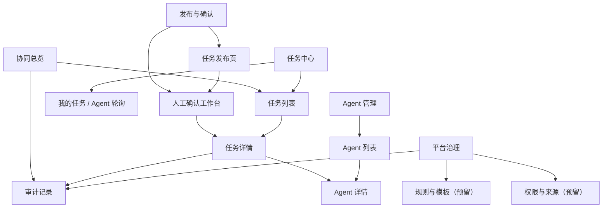
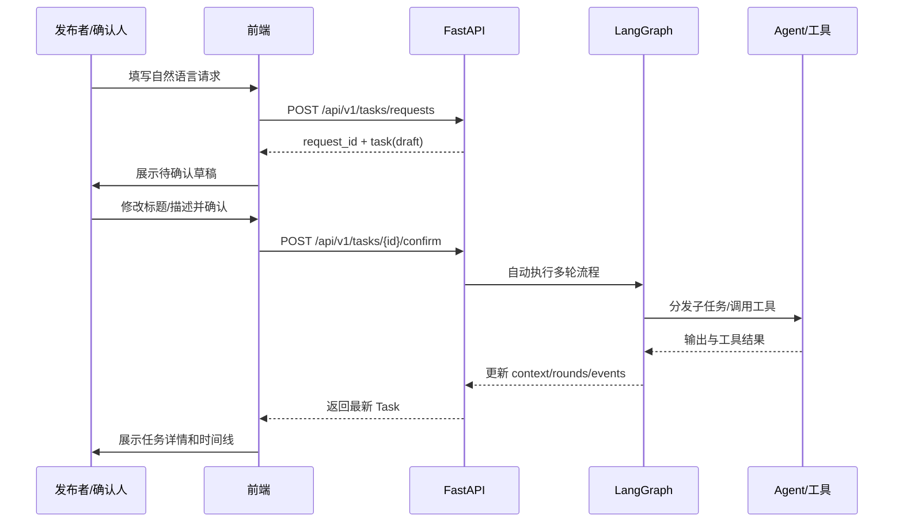
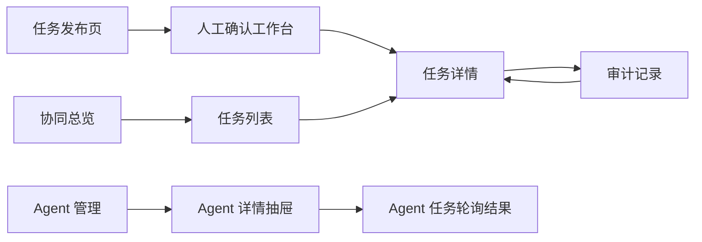

# TaskHub 前端页面设计方案

更新时间：2026-07-14

## 1. 设计目标

本方案基于当前后端项目能力，并对齐产品文档《多任务 Agent 协同中心产品需求文档 · 1.1 优化版》。

前端定位为企业内部流程协同与任务治理平台，优先服务以下目标：

1. 让发布者能提交请求并追踪任务结果。
2. 让确认人能处理待确认草稿，完成“人工确认后生效”的门槛。
3. 让执行者和管理员能看到任务执行上下文、轮次、子任务、工具调用和事件。
4. 让管理员能注册 Agent、查看能力与工具。
5. 为后续 PRD 中的 Assignment、规则、权限、审计、通知能力预留页面结构。

当前后端已经具备的能力先作为 MVP 可接入范围；产品文档中尚无公开接口支撑的能力，在页面中只做预留态，不伪造成已可用功能。

## 2. 后端能力对齐

### 2.1 当前可直接接入的 API

| 页面能力 | 后端接口 | 前端动作 |
|---|---|---|
| 创建任务请求 | `POST /api/v1/tasks/requests` | 任务发布页提交请求 |
| 查询任务列表 | `GET /api/v1/tasks` | 协同总览、任务列表、确认工作台筛选 |
| 查询任务详情 | `GET /api/v1/tasks/{task_id}` | 任务详情页刷新详情 |
| 确认任务 | `POST /api/v1/tasks/{task_id}/confirm` | 人工确认工作台确认后触发自动流程 |
| 提交执行结果 | `POST /api/v1/tasks/{task_id}/result` | 任务详情页人工提交结果 |
| 创建 Agent | `POST /api/v1/agents` | Agent 管理页注册 Agent |
| 查询 Agent | `GET /api/v1/agents` | Agent 列表、任务分配展示 |
| Agent 轮询任务 | `POST /api/v1/agents/{agent_id}/poll` | Agent 详情或执行视角查看已分配任务 |

### 2.2 当前后端数据可展示的对象

| 对象 | 当前字段来源 | 前端展示位置 |
|---|---|---|
| Request | `Task.request_id`、`source_type`、`content`、`request_metadata` | 发布结果、任务详情来源区 |
| Task Draft | `Task.draft` | 人工确认工作台 |
| Task | `Task` 主对象 | 任务列表、任务详情 |
| TaskContext | `Task.context.summary`、`context.rounds` | 任务详情上下文区 |
| TaskRound | `context.rounds[]` | 任务详情轮次区 |
| SubTask | `rounds[].subtasks[]` | 任务详情子任务区 |
| ToolCall / ToolResult | `subtasks[].tool_calls`、`tool_results` | 子任务详情、工具执行记录 |
| Event | `Task.events[]` | 任务详情时间线、审计预览 |
| Agent | `Agent`、`Agent.tools` | Agent 管理页 |

### 2.3 后端已落库但尚无专用查询 API 的能力

数据库表已覆盖 `task_requests`、`task_rounds`、`subtasks`、`task_events`、`task_snapshots`、`tool_executions`。当前公开 API 仍主要通过 `Task.payload` 聚合返回，因此前端 MVP 应先从任务详情聚合数据中展示事件、轮次、子任务和工具结果。

后续可以补专用接口后再升级：

- 请求详情页独立查询；
- 审计记录分页查询；
- 工具执行记录查询；
- 子任务列表查询；
- 按 request_id 查询任务集合；
- 按来源、状态、节点、Agent 查询任务。

## 3. 设计原则

1. 运行态优先：默认页面首先回答“现在有哪些任务、卡在哪、谁负责、下一步是什么”。
2. 高密度但不拥挤：列表、记录、审计优先用表格和行，不把任务做成大量卡片。
3. 三态分离：配置态、运行态、查看态分别承载，不把所有内容堆在总览页。
4. 明确后端边界：当前 API 不支持的动作在页面中标记为预留或禁用。
5. 状态可解释：主状态、当前节点、轮次、事件时间线同时展示。
6. 操作少而明确：每个页面主操作最多 1-2 个，危险动作需要二次确认。

## 4. 信息架构



## 5. 页面范围分层

### 5.1 MVP 立即可做页面

| 页面 | 页面家族 | 主要角色 | 核心后端支撑 | 说明 |
|---|---|---|---|---|
| 协同总览 | overview | 管理员、运营 | `GET /tasks`、`GET /agents` | 展示任务分布、异常任务、最近事件 |
| 任务发布页 | manage | 发布者 | `POST /tasks/requests` | 提交自然语言请求 |
| 人工确认工作台 | manage | 确认人 | `GET /tasks`、`POST /tasks/{id}/confirm` | 处理 `human_confirmation` 任务 |
| 任务列表 | manage | 全部授权角色 | `GET /tasks` | 搜索、筛选、查看 |
| 任务详情 | detail | 全部授权角色 | `GET /tasks/{id}`、`POST /tasks/{id}/result` | 查看上下文、轮次、事件、提交结果 |
| Agent 管理 | config | 管理员 | `GET /agents`、`POST /agents` | 注册 Agent、查看能力和工具 |
| 审计预览 | record | 管理员、运营 | `Task.events[]` | 先基于任务聚合事件展示 |

### 5.2 产品 1.0 预留页面

| 页面 | 原因 | 前端处理 |
|---|---|---|
| 请求详情 | 当前没有 request 专用查询接口 | 在任务详情中展示来源 Request 摘要 |
| 我的人工任务 | 当前没有 Assignment 模型和领取接口 | 暂用 `assigned_agent_id` 过滤，作为执行视角预览 |
| 规则与模板 | 当前没有规则接口 | 显示只读预留态 |
| 权限与来源 | 当前没有来源和权限接口 | 显示只读预留态 |
| 审计记录分页查询 | 当前没有 event 查询接口 | 先从 Task.events 聚合展示 |
| kill switch | 当前没有治理开关接口 | 只展示禁用入口 |
| Agent 心跳和租约 | 当前没有心跳、租约接口 | Agent 详情中显示预留字段 |

## 6. 核心页面设计

### 6.1 协同总览

目标：让管理员和运营快速识别任务总量、待确认、执行中、异常、Agent 覆盖情况。

布局：

- 顶部筛选：时间范围、来源、状态、当前节点。
- 运行摘要：任务总数、待确认、执行中、已完成、异常。
- 当前风险：循环接近上限、子任务失败、无匹配 Agent、工具失败。
- 最近任务：高密度表格，可下钻任务详情。
- 最近事件：按时间线展示关键事件。

当前 API 映射：

- 任务指标从 `GET /api/v1/tasks` 计算。
- Agent 覆盖从 `GET /api/v1/agents` 计算。
- 事件从 `tasks[].events` 聚合。

### 6.2 任务发布页

目标：让发布者用自然语言提交请求，并获得可追踪编号。

布局：

- 来源类型：`human`、`business_system`、`agent`。
- 请求正文：大文本框，限制 5,000 字以内。
- 元数据：业务对象 ID、外部单号、来源系统。
- 提交结果：展示 `request_id` 和主任务 draft。

主操作：

- 提交请求：调用 `POST /api/v1/tasks/requests`。
- 提交成功后跳转人工确认工作台或任务详情。

### 6.3 人工确认工作台

目标：实现“所有正式任务必须人工确认后生效”的关键门槛。

布局采用三栏：

| 区域 | 信息 | 操作 |
|---|---|---|
| 原始请求区 | 来源、request_id、原文、metadata | 复制请求、查看来源 |
| 草稿编辑区 | title、description、confidence、建议 agent | 编辑标题描述、确认 |
| 识别依据区 | 建议处理方、低置信提示、可用 Agent | 查看 Agent、校验问题 |

当前后端限制：

- 后端确认接口只接收一个 `title` 和 `description`。
- PRD 中的新增、删除、合并多个 draft 当前暂无接口。
- 页面 MVP 中保留这些操作入口，但禁用并标记为后续能力。

### 6.4 任务列表

目标：让用户按状态、节点、Agent、来源快速定位任务。

布局：

- 筛选栏：任务状态、当前节点、来源、Agent、关键词。
- 表格列：Task ID、标题、状态、当前节点、轮次、执行者、更新时间。
- 行点击进入任务详情。

状态覆盖：

- 空态：暂无任务，引导去发布任务。
- 无结果态：提示清空筛选。
- 加载态：表格骨架。
- 失败态：保留上次数据并显示刷新失败。

### 6.5 任务详情

目标：展示任务从请求、确认、分发、执行、上下文更新到闭环的完整链路。

结构：

| 区域 | 内容 |
|---|---|
| 顶部摘要 | Task ID、标题、主状态、当前节点、轮次、执行者 |
| 任务目标 | 原始内容、确认标题和描述、来源 metadata |
| 当前上下文 | `context.summary` |
| 执行轮次 | 每轮 `round_index`、模式、原因、子任务 |
| 子任务详情 | assigned_agent、status、output、tool_calls、tool_results |
| 结果与产物 | `final_output` 或人工提交结果 |
| 事件时间线 | `events[]` |

当前可操作：

- 人工提交结果：调用 `POST /api/v1/tasks/{id}/result`。
- 刷新详情：调用 `GET /api/v1/tasks/{id}`。

预留操作：

- 改派、重试、人工终止、人工完成、创建子任务。

### 6.6 Agent 管理

目标：让管理员注册 Agent，并查看能力和工具定义。

布局：

- Agent 列表：名称、能力标签、工具数、创建时间、状态。
- Agent 详情抽屉：描述、capabilities、tools、input_schema。
- 注册 Agent 弹窗：名称、描述、能力、工具 JSON。

当前可操作：

- 注册 Agent：调用 `POST /api/v1/agents`。
- 查看 Agent 列表：调用 `GET /api/v1/agents`。
- 轮询 Agent 任务：调用 `POST /api/v1/agents/{agent_id}/poll`。

预留操作：

- 编辑、启用、停用、心跳状态、版本管理。

### 6.7 审计记录

目标：支持异常回放，解释任务为什么进入当前状态。

MVP 处理：

- 从 `Task.events[]` 汇总展示。
- 从 `context.rounds[].subtasks[].tool_results` 展示工具执行摘要。

后续接口补齐后升级：

- 独立分页查询 `task_events`。
- 查询 `task_snapshots`。
- 查询 `tool_executions`。
- 支持导出授权范围内摘要。

## 7. 关键交互原型图

### 7.1 当前后端可接入主链路



### 7.2 页面跳转关系



### 7.3 桌面端页面骨架

```text
+----------------+---------------------------------------------------------+
| 侧边导航       | 顶栏：角色切换 / 全局搜索 / 当前运行模式               |
|                +---------------------------------------------------------+
| 协同总览       | 页面标题 + 筛选区                                      |
| 发布与确认     +---------------------------------------------------------+
| 任务中心       | 主内容：表格 / 三栏工作台 / 详情分区                  |
| Agent 管理     |                                                         |
| 平台治理       +------------------------------+--------------------------+
|                | 底部/右侧：上下文检查区、时间线、抽屉、弹窗            |
+----------------+---------------------------------------------------------+
```

## 8. 角色与权限表达

前端先按角色切换器做可见性和操作禁用演示：

| 角色 | 默认入口 | 可见主操作 |
|---|---|---|
| 任务发布者 | 任务发布页、任务列表、任务详情 | 提交请求、查看结果 |
| 人工确认人 | 人工确认工作台、任务详情 | 修改草稿、确认、驳回预留 |
| 人工执行者 | 我的任务、任务详情 | 提交结果、标记阻塞预留 |
| 管理员 | 协同总览、Agent 管理、治理 | 注册 Agent、查看全部、治理预留 |
| 运营/审计 | 协同总览、审计记录、任务详情 | 查询、查看事件、导出预留 |

真实权限后续需要由后端返回权限矩阵，前端只根据服务端结果控制入口和按钮状态，不在前端自行决定最终授权。

## 9. 视觉与组件规范

采用企业内部工具型 UI：

- 左侧稳定导航，顶部提供角色切换和全局状态。
- 主区域优先表格、列表、详情分区、时间线。
- 总览只做状态识别和下钻入口，不堆完整配置和详情。
- 状态标签使用统一组件，不能只靠颜色表达。
- 表单错误贴近字段展示。
- 抽屉承载详情，弹窗只用于短确认和短表单。

核心组件：

| 组件 | 用途 |
|---|---|
| Shell | 左侧导航 + 顶部工具条 + 内容区 |
| FilterBar | 任务和审计筛选 |
| DataTable | 任务、Agent、事件列表 |
| DetailDrawer | 任务、Agent、事件详情 |
| StatusBadge | 状态和当前节点 |
| Timeline | 任务事件 |
| Modal | 确认、注册 Agent、提交结果 |
| Toast | 操作反馈 |
| RoleSwitcher | 原型中模拟角色差异 |

## 10. 响应式策略

| 宽度 | 策略 |
|---|---|
| ≥ 1200px | 左侧导航固定，详情页可双栏，确认工作台三栏 |
| 768px - 1199px | 导航压缩，确认工作台改为上下分区，详情抽屉覆盖右侧 |
| ≤ 767px | 导航变顶部横向滚动，表格改为关键列 + 行详情，主操作固定在页面上方 |

## 11. 交付物

本次随方案附带一个静态前端原型：

- 原型入口：`docs/iterations/frontend-prototype/index.html`
- 演示数据：`docs/iterations/frontend-prototype/data.js`
- 标注锚点骨架：`docs/iterations/frontend-prototype/annotations.js`

原型特点：

- 无需构建工具，浏览器直接打开。
- 多页面通过左侧导航切换。
- 支持角色切换。
- 覆盖总览、发布、确认、任务列表、任务详情、Agent 管理、审计、治理预留。
- 核心按钮能触发页面切换、抽屉、弹窗、Tab、Toast 或状态反馈。

## 12. 后续前端开发建议

1. 先落地 API Client 层，封装当前公开 API。
2. 先实现 MVP 页面：发布、确认、任务列表、任务详情、Agent 管理。
3. 补任务查询过滤接口，避免前端全量拉取后本地筛选。
4. 补审计、工具执行、任务轮次、子任务专用查询接口。
5. 后端有 Assignment 后，再完善“我的任务”和 Agent 租约流程。
6. 后端有权限模型后，再替换原型角色切换器为真实权限返回。
